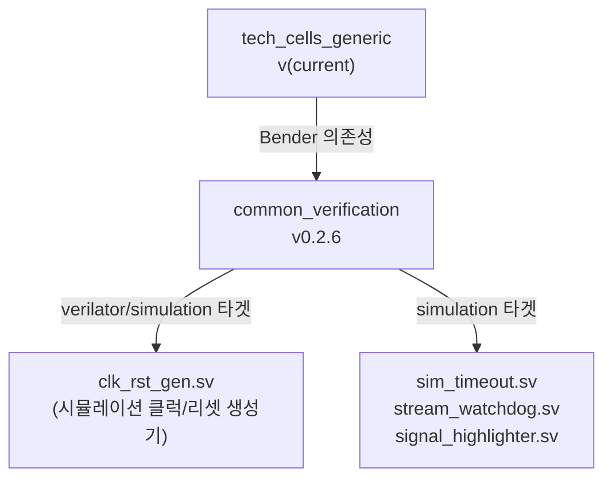
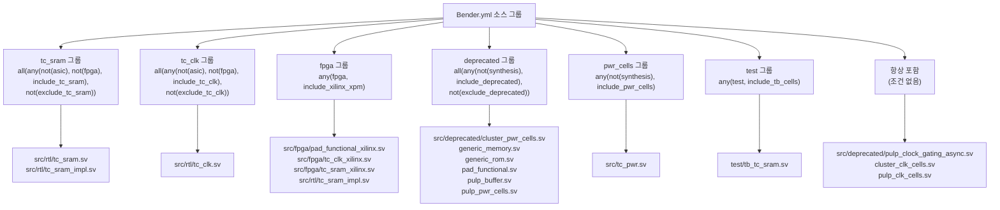

# Bender.yml

Bender 패키지 매니페스트 파일로, 이 패키지의 이름과 의존성, 소스 파일 목록을 정의합니다.

## 의존성 그래프

## 소스 파일 타겟 조건 맵

## 패키지 정보

- **이름**: `tech_cells_generic`

## 의존성

| 패키지 | 소스 | 버전 |
|--------|------|------|
| `common_verification` | GitHub (`chorus96/common_verification`) | 0.2.6 |

`common_verification`은 시뮬레이션용 클럭/리셋 생성기(`clk_rst_gen`) 등을 제공합니다.

## 타겟별 파일 포함 규칙

| 타겟 조합 | 포함 파일 그룹 |
|-----------|---------------|
| `rtl` (기본 시뮬레이션) | tc_sram, tc_clk, deprecated(일부), pwr_cells |
| `test` | + tb_tc_sram.sv |
| `verilator` | + common_verification의 clk_rst_gen 등 |
| `fpga` / `xilinx` | FPGA 구현체 (tc_sram_xilinx, tc_clk_xilinx 등) |
| `tech_cells_generic_exclude_deprecated` | deprecated 파일 제외 |
| `synthesis` | deprecated 파일 제외 (not(synthesis) 조건) |

## 관련 파일

- [`src_files.yml`](src_files.yml.md) — FuseSoC 스타일 소스 목록 (레거시)
- [`scripts/compile_vltor.sh`](scripts/compile_vltor.sh.md) — Verilator용 파일 목록 생성
- [`scripts/compile_vsim.sh`](scripts/compile_vsim.sh.md) — QuestaSim용 컴파일 스크립트
