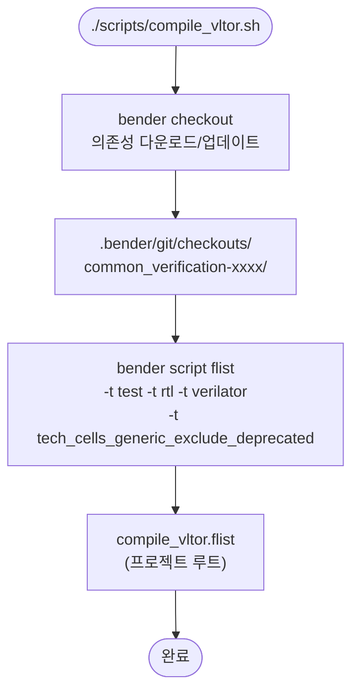
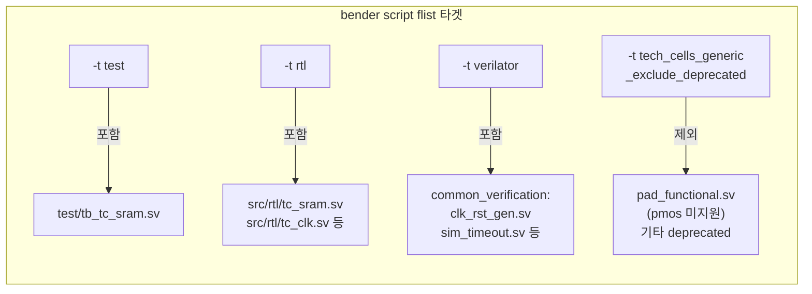

# compile_vltor.sh

Verilator 시뮬레이션을 위한 소스 파일 목록(flist)을 생성하는 스크립트입니다. QuestaSim의 [`compile_vsim.sh`](compile_vsim.sh.md)에 대응합니다.

## 실행 흐름



## 타겟 선택 이유



## 생성되는 flist 형식

```
/path/to/common_verification/src/clk_rst_gen.sv
/path/to/common_verification/src/sim_timeout.sv
...
/path/to/tech_cells_generic/src/rtl/tc_sram.sv
/path/to/tech_cells_generic/src/rtl/tc_clk.sv
...
/path/to/tech_cells_generic/test/tb_tc_sram.sv
```

Verilator `-f` 옵션으로 직접 사용 가능한 파일 경로 목록입니다.

## 사용된 Bender 타겟

| 타겟 | 목적 |
|------|------|
| `test` | 테스트벤치 파일(`tb_tc_sram.sv`) 포함 |
| `rtl` | RTL 소스 파일 포함 |
| `verilator` | Verilator 호환 시뮬레이션 파일 포함 (`clk_rst_gen.sv` 등) |
| `tech_cells_generic_exclude_deprecated` | `pmos` 등 Verilator 미지원 게이트 프리미티브 제외 |

## 출력

- `{루트}/compile_vltor.flist` — `.gitignore`에 의해 버전 관리 제외

## 사용법

```bash
cd tech_cells_generic
bash scripts/compile_vltor.sh
# → compile_vltor.flist 생성
bash scripts/run_vltor.sh
```

## 관련 파일

- [`run_vltor.sh`](run_vltor.sh.md) — 생성된 flist를 사용하여 Verilator 시뮬레이션 실행
- [`compile_vsim.sh`](compile_vsim.sh.md) — QuestaSim 대응 스크립트
- [`../Bender.yml`](../Bender.yml.md) — 타겟 조건 정의
