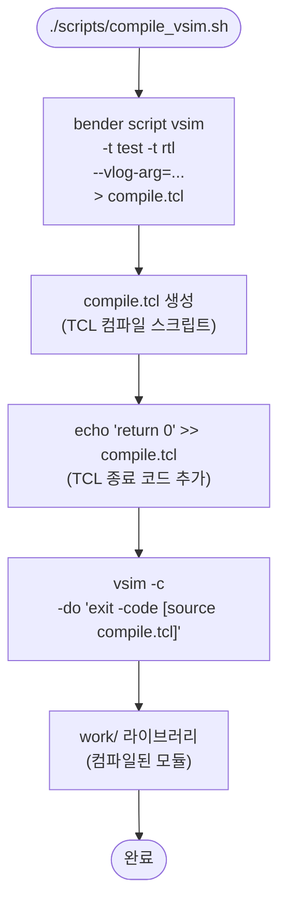
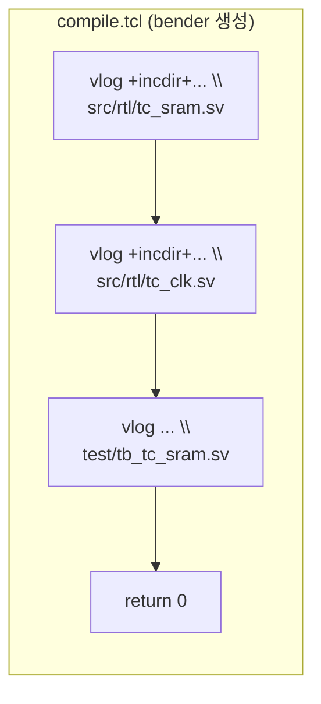
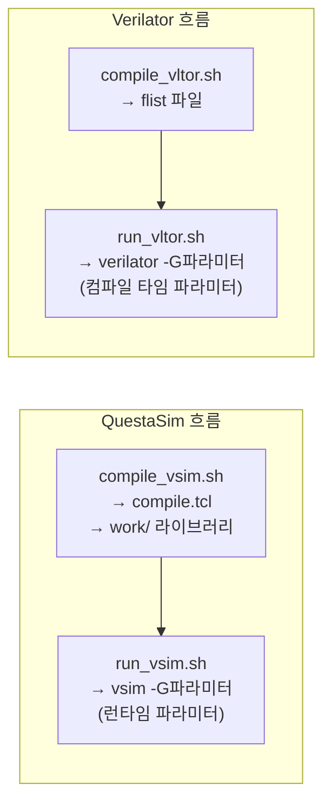

# compile_vsim.sh

QuestaSim(ModelSim) 시뮬레이션을 위해 소스 파일을 컴파일하는 스크립트입니다.

## 실행 흐름



## 생성되는 compile.tcl 구조



## 사용된 Bender/QuestaSim 옵션

| 옵션 | 설명 |
|------|------|
| `-t test` | 테스트벤치 파일(`tb_tc_sram.sv`) 포함 |
| `-t rtl` | RTL 소스 파일 포함 |
| `--vlog-arg="-svinputport=compat"` | SV 입력 포트 호환 모드 (암묵적 포트 방향) |
| `--vlog-arg="-override_timescale 1ns/1ps"` | 모든 파일에 타임스케일 강제 설정 |
| `vsim -c` | 비대화형(command-line) 모드로 vsim 실행 |

## vsim과 Verilator 컴파일 비교



핵심 차이: vsim은 런타임 파라미터 오버라이드가 가능하지만, Verilator는 파라미터별로 재컴파일이 필요합니다.

## 출력

- `compile.tcl` — QuestaSim용 TCL 컴파일 스크립트 (중간 생성물, gitignore 미지정)
- `work/` — QuestaSim 컴파일 라이브러리 디렉토리

## 사용법

```bash
bash scripts/compile_vsim.sh   # 컴파일 (최초 1회 또는 소스 변경 시)
bash scripts/run_vsim.sh       # 시뮬레이션 실행
```

## 관련 파일

- [`run_vsim.sh`](run_vsim.sh.md) — 컴파일된 라이브러리로 시뮬레이션 실행
- [`compile_vltor.sh`](compile_vltor.sh.md) — Verilator 대응 스크립트
