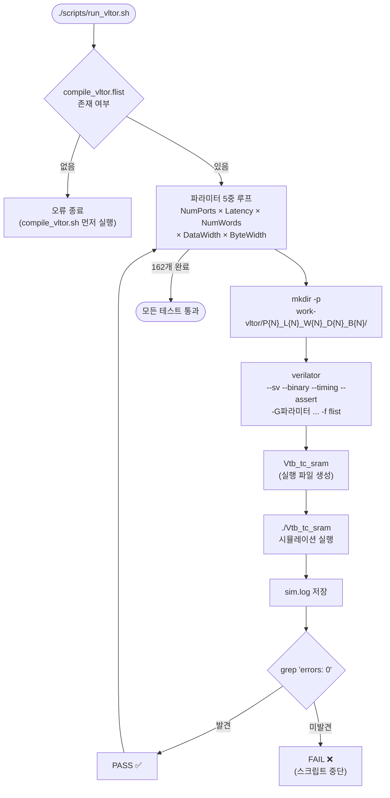
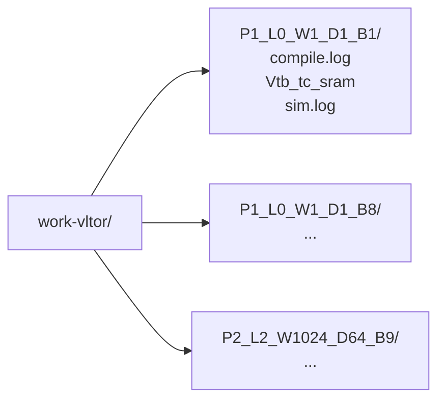
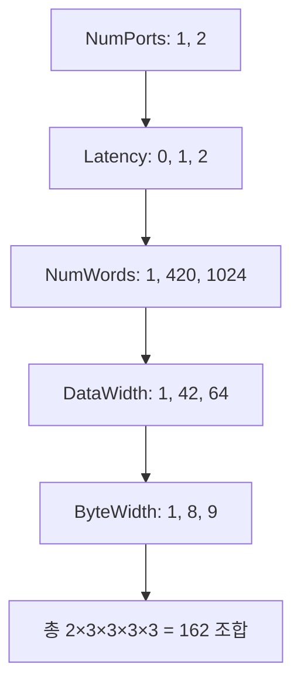
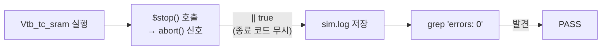

# run_vltor.sh

Verilator로 `tb_tc_sram` 테스트벤치를 다양한 파라미터 조합으로 컴파일하고 실행하는 스크립트입니다. QuestaSim의 [`run_vsim.sh`](run_vsim.sh.md)에 대응합니다.

## 전체 실행 흐름



## 빌드 디렉토리 구조



각 파라미터 조합마다 독립된 빌드/실행 디렉토리를 생성합니다 (총 162개).

## 파라미터 스윕



## Verilator 컴파일 플래그

| 플래그 | 설명 |
|--------|------|
| `--sv` | SystemVerilog 모드 |
| `--binary` | C++ 생성 + 컴파일 + 링크 한 번에 처리 |
| `--timing` | `#delay`, `fork...join_none`, `wait` 등 타이밍 구문 지원 |
| `--assert` | SystemVerilog assertion 활성화 |
| `--timescale 1ns/1ps` | 타임스케일 (테스트벤치 `CyclTime=10ns` 등 처리) |
| `-Wno-WIDTHTRUNC` | 비트 폭 축소 경고 억제 |
| `-Wno-WIDTHEXPAND` | 비트 폭 확장 경고 억제 |
| `-Wno-UNSIGNED` | 상수 비부호 비교 경고 억제 |
| `-Wno-INITIALDLY` | initial 블록 내 비블로킹 딜레이 경고 억제 |
| `-Wno-ASCRANGE` | 상행 범위 선언 경고 억제 (`NumWords=1` 시 발생) |
| `-GParam=value` | 컴파일 타임 파라미터 오버라이드 |
| `-f flist` | 소스 파일 목록 지정 |

## `$stop()` 처리 방식



## 환경 변수

| 변수 | 기본값 | 설명 |
|------|--------|------|
| `VERILATOR` | `verilator` | 사용할 Verilator 실행 파일 경로 |

## 사용법

```bash
bash scripts/compile_vltor.sh   # flist 생성 (최초 1회)
bash scripts/run_vltor.sh       # 전체 162개 조합 시뮬레이션
# 특정 파라미터만 테스트
VERILATOR=/path/to/verilator bash scripts/run_vltor.sh
```

## 관련 파일

- [`compile_vltor.sh`](compile_vltor.sh.md) — flist 생성 (사전 실행 필요)
- [`run_vsim.sh`](run_vsim.sh.md) — QuestaSim 대응 스크립트
- [`../test/tb_tc_sram.sv`](../test/tb_tc_sram.sv.md) — 실행되는 테스트벤치
