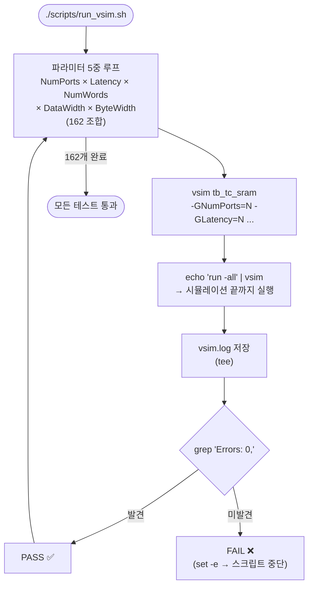
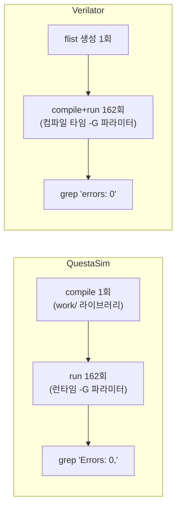

# run_vsim.sh

QuestaSim으로 `tb_tc_sram` 테스트벤치를 다양한 파라미터 조합으로 실행하는 스크립트입니다.

## 실행 흐름



## vsim 실행 방식

```bash
echo "run -all" | vsim tb_tc_sram \
    -GNumPorts=1 -GLatency=0 -GNumWords=1 \
    -GDataWidth=1 -GByteWidth=1 | tee vsim.log 2>&1
grep "Errors: 0," vsim.log
```

QuestaSim은 런타임(`-G`) 파라미터 오버라이드를 지원하므로 컴파일 없이 동일한 라이브러리로 모든 조합을 실행할 수 있습니다.

## 파라미터 스윕

| 파라미터 | 값 | 설명 |
|----------|----|------|
| `NumPorts` | 1, 2 | SRAM 포트 수 |
| `Latency` | 0, 1, 2 | 읽기 레이턴시 (클럭 사이클) |
| `NumWords` | 1, 420, 1024 | SRAM 워드 수 |
| `DataWidth` | 1, 42, 64 | 데이터 비트 폭 |
| `ByteWidth` | 1, 8, 9 | 바이트 비트 폭 |

총 **2 × 3 × 3 × 3 × 3 = 162** 조합

## vsim vs Verilator 시뮬레이션 비교



## 환경 변수

| 변수 | 기본값 | 설명 |
|------|--------|------|
| `VSIM` | `vsim` | 사용할 QuestaSim 실행 파일 경로 |

## 사용법

```bash
bash scripts/compile_vsim.sh   # 사전 컴파일 필요
bash scripts/run_vsim.sh       # 전체 162개 조합 시뮬레이션
```

## 관련 파일

- [`compile_vsim.sh`](compile_vsim.sh.md) — 사전 컴파일 스크립트
- [`run_vltor.sh`](run_vltor.sh.md) — Verilator 대응 스크립트
- [`../test/tb_tc_sram.sv`](../test/tb_tc_sram.sv.md) — 실행되는 테스트벤치
