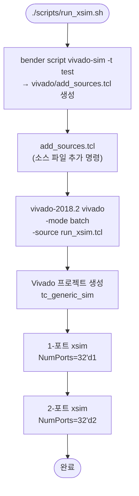
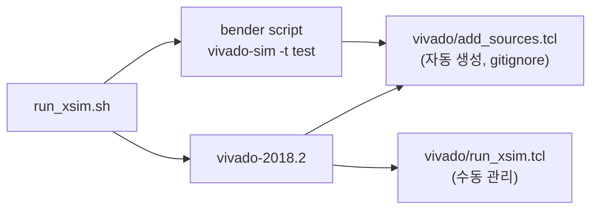

# run_xsim.sh

Xilinx Vivado의 xsim 시뮬레이터로 시뮬레이션을 실행하는 스크립트입니다.

## 실행 흐름



## 스크립트 간 관계



## 설정

| 변수 | 값 | 설명 |
|------|----|------|
| `VIVADO_VER` | `2018.2` | 사용할 Vivado 버전 |

## 의존 파일

- [`vivado/run_xsim.tcl`](vivado/run_xsim.tcl.md) — Vivado 프로젝트 생성 및 시뮬레이션 TCL
- `vivado/add_sources.tcl` — Bender 생성 (`.gitignore` 적용)

## 사용법

```bash
# Vivado 2018.2가 PATH에 있어야 함
bash scripts/run_xsim.sh
```

## 관련 파일

- [`run_vsim.sh`](run_vsim.sh.md) — QuestaSim 대응 스크립트
- [`run_vltor.sh`](run_vltor.sh.md) — Verilator 대응 스크립트
