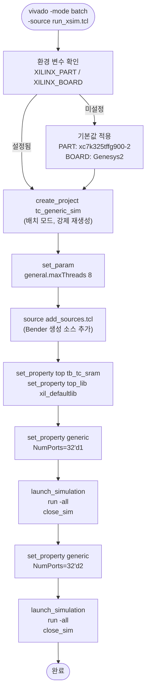
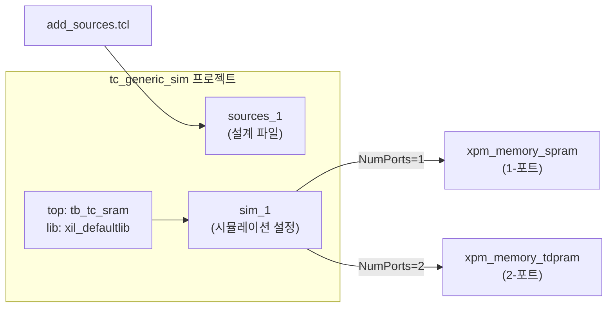

# run_xsim.tcl

Vivado xsim으로 `tb_tc_sram`을 시뮬레이션하는 TCL 스크립트입니다. [`run_xsim.sh`](../run_xsim.sh.md)에 의해 배치 모드로 호출됩니다.

## 실행 흐름



## 프로젝트 구성



## 시뮬레이션 설정 (2회)

| 실행 | `NumPorts` | XPM 매크로 |
|------|-----------|-----------|
| 1차 | `32'd1` | `xpm_memory_spram` |
| 2차 | `32'd2` | `xpm_memory_tdpram` |

## 환경 변수

| 변수 | 기본값 | 설명 |
|------|--------|------|
| `XILINX_PART` | `xc7k325tffg900-2` | 타겟 FPGA 파트 번호 (Kintex-7) |
| `XILINX_BOARD` | `digilentinc.com:genesys2:part0:1.1` | 타겟 보드 (Digilent Genesys2) |

## XPM 사전 설정 필요

```tcl
# Vivado에서 XPM 매크로 인식을 위해 필요 (외부 설정):
set_property XPM_LIBRARIES XPM_MEMORY [current_project]
# 또는
auto_detect_xpm
```

## 관련 파일

- [`../run_xsim.sh`](../run_xsim.sh.md) — 이 스크립트를 호출하는 쉘 스크립트
- [`../../src/fpga/tc_sram_xilinx.sv`](../../src/fpga/tc_sram_xilinx.sv.md) — XPM 기반 SRAM 구현체
- [`../../src/fpga/tc_clk_xilinx.sv`](../../src/fpga/tc_clk_xilinx.sv.md) — Xilinx 클럭 셀
