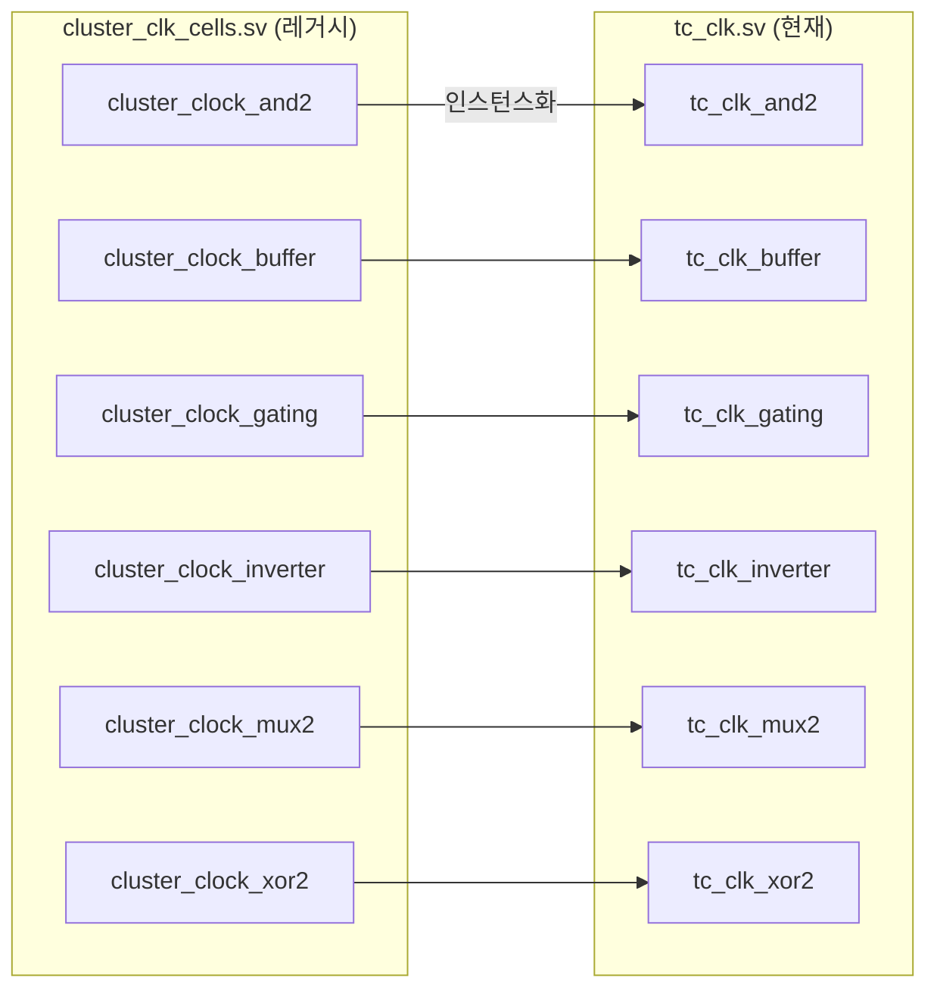

# cluster_clk_cells.sv

`cluster_clock_*` 이름 체계를 사용하는 레거시 클럭 셀 래퍼 모음입니다. 내부적으로 [`src/rtl/tc_clk.sv`](../rtl/tc_clk.sv.md)의 `tc_clk_*` 셀을 인스턴스화합니다.

> **Deprecated** — 신규 설계에서는 `tc_clk_*` 셀을 직접 사용하세요.

## 래핑 구조

## 포함 모듈 및 매핑

| 레거시 모듈 | 내부 인스턴스 | 포트 연결 |
|------------|-------------|-----------|
| `cluster_clock_and2` | `tc_clk_and2 i_tc_clk_and2` | `.clk0_i, .clk1_i, .clk_o` |
| `cluster_clock_buffer` | `tc_clk_buffer i_tc_clk_buffer` | `.clk_i, .clk_o` |
| `cluster_clock_gating` | `tc_clk_gating i_tc_clk_gating` | `.clk_i, .en_i, .test_en_i, .clk_o` |
| `cluster_clock_inverter` | `tc_clk_inverter i_tc_clk_inverter` | `.clk_i, .clk_o` |
| `cluster_clock_mux2` | `tc_clk_mux2 i_tc_clk_mux2` | `.clk0_i, .clk1_i, .clk_sel_i, .clk_o` |
| `cluster_clock_xor2` | `tc_clk_xor2 i_tc_clk_xor2` | `.clk0_i, .clk1_i, .clk_o` |

모든 포트는 동일한 이름으로 implicit port connection(`.port_name`)으로 연결됩니다.

## 관련 파일

- [`../rtl/tc_clk.sv`](../rtl/tc_clk.sv.md) — 현재 권장 클럭 셀
- [`pulp_clk_cells.sv`](pulp_clk_cells.sv.md) — 동일한 `pulp_clock_*` 레거시 래퍼
