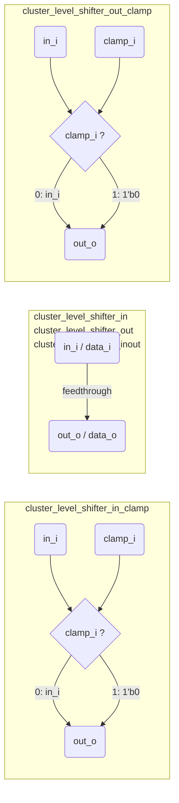

# cluster_pwr_cells.sv

`cluster_level_shifter_*` 이름 체계를 사용하는 레거시 전력 셀 모음입니다. 행동 모델로 단순 조합 논리로 구현됩니다.

> **Deprecated** — 신규 설계에서는 [`src/tc_pwr.sv`](../tc_pwr.sv.md)의 `tc_pwr_*` 셀을 사용하세요.

## 셀 구조

## 포함 모듈

| 모듈 | 동작 | `tc_pwr` 대응 |
|------|------|--------------|
| `cluster_level_shifter_in` | `out_o = in_i` | `tc_pwr_level_shifter_in` |
| `cluster_level_shifter_in_clamp` | `out_o = clamp_i ? 0 : in_i` | `tc_pwr_level_shifter_in_clamp_lo` |
| `cluster_level_shifter_inout` | `data_o = data_i` | — (양방향 feedthrough) |
| `cluster_level_shifter_out` | `out_o = in_i` | `tc_pwr_level_shifter_out` |
| `cluster_level_shifter_out_clamp` | `out_o = clamp_i ? 0 : in_i` | `tc_pwr_level_shifter_out_clamp_lo` |

> `tc_pwr.sv`는 `_clamp_lo`와 `_clamp_hi`를 구분하지만, 이 파일의 clamp 동작은 `1'b0`(lo)만 지원합니다.

## 관련 파일

- [`../tc_pwr.sv`](../tc_pwr.sv.md) — 현재 권장 전력 셀
- [`pulp_pwr_cells.sv`](pulp_pwr_cells.sv.md) — 동일한 `pulp_*` 레거시 래퍼
