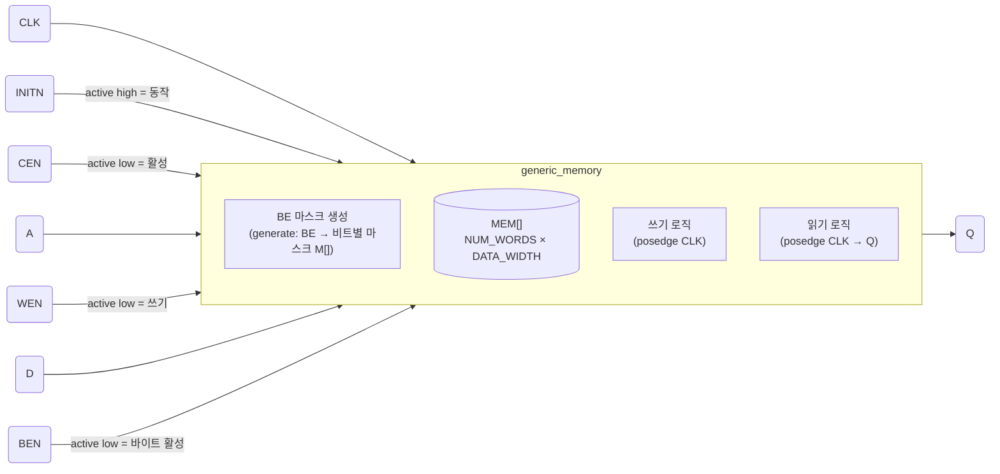
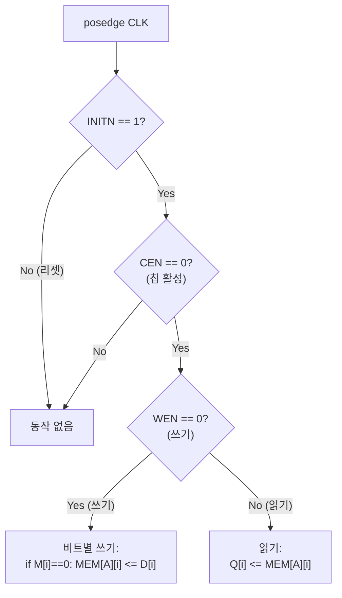

# generic_memory.sv

레거시 범용 SRAM 행동 모델입니다. PULP 플랫폼의 구형 인터페이스(active-low CEN, WEN)를 사용합니다.

> **Deprecated** — 신규 설계에서는 [`src/rtl/tc_sram.sv`](../rtl/tc_sram.sv.md)를 사용하세요.

## 블록 다이어그램



## 내부 동작 흐름



## 바이트 인에이블 마스크 생성

```
generate for i=0..BE_WIDTH-1:
  for j=0..7:
    M[i*8+j] = BEN[i]   // BEN은 active-low → M=0 시 쓰기 허용
```

## 모듈: `generic_memory`

### 파라미터

| 파라미터 | 기본값 | 설명 |
|----------|--------|------|
| `ADDR_WIDTH` | 12 | 주소 비트 폭. 워드 수 = `2^ADDR_WIDTH` (4096) |
| `DATA_WIDTH` | 32 | 데이터 비트 폭 |
| `BE_WIDTH` | `DATA_WIDTH/8` | 바이트 인에이블 폭 (기본 4) |

### 포트

| 포트 | 방향 | 극성 | 설명 |
|------|------|------|------|
| `CLK` | input | — | 클럭 (상승 에지) |
| `INITN` | input | active high | 정상 동작 인에이블 (0: 비활성) |
| `CEN` | input | **active low** | 칩 인에이블 |
| `A` | input | — | 주소 |
| `WEN` | input | **active low** | 쓰기 인에이블 |
| `D` | input | — | 쓰기 데이터 |
| `BEN` | input | **active low** | 바이트 인에이블 |
| `Q` | output | — | 읽기 데이터 (1사이클 레이턴시) |

### `tc_sram`과의 인터페이스 비교

| 항목 | `generic_memory` | `tc_sram` |
|------|-----------------|-----------|
| 인에이블 극성 | Active low | Active high |
| 리셋 신호 | `INITN` (active high) | `rst_ni` (active low) |
| 워드 수 | `2^ADDR_WIDTH` | `NumWords` (직접 지정) |
| 포트 수 | 1 | `NumPorts` (파라미터) |
| 레이턴시 | 1 (고정) | `Latency` (파라미터) |

## 관련 파일

- [`../rtl/tc_sram.sv`](../rtl/tc_sram.sv.md) — 현재 권장 SRAM 모듈
