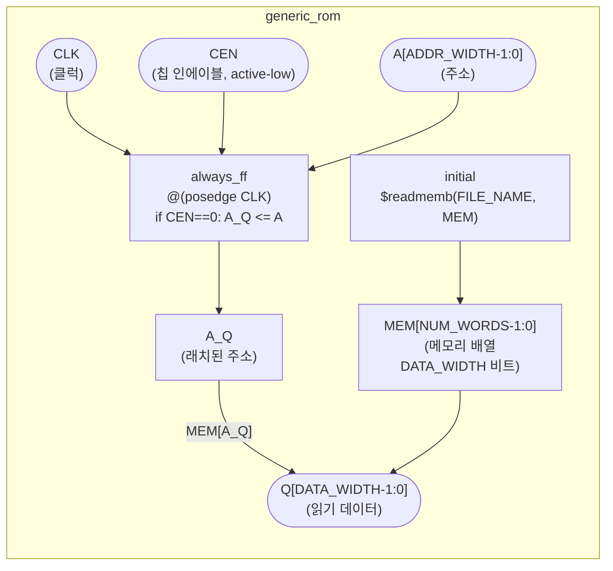
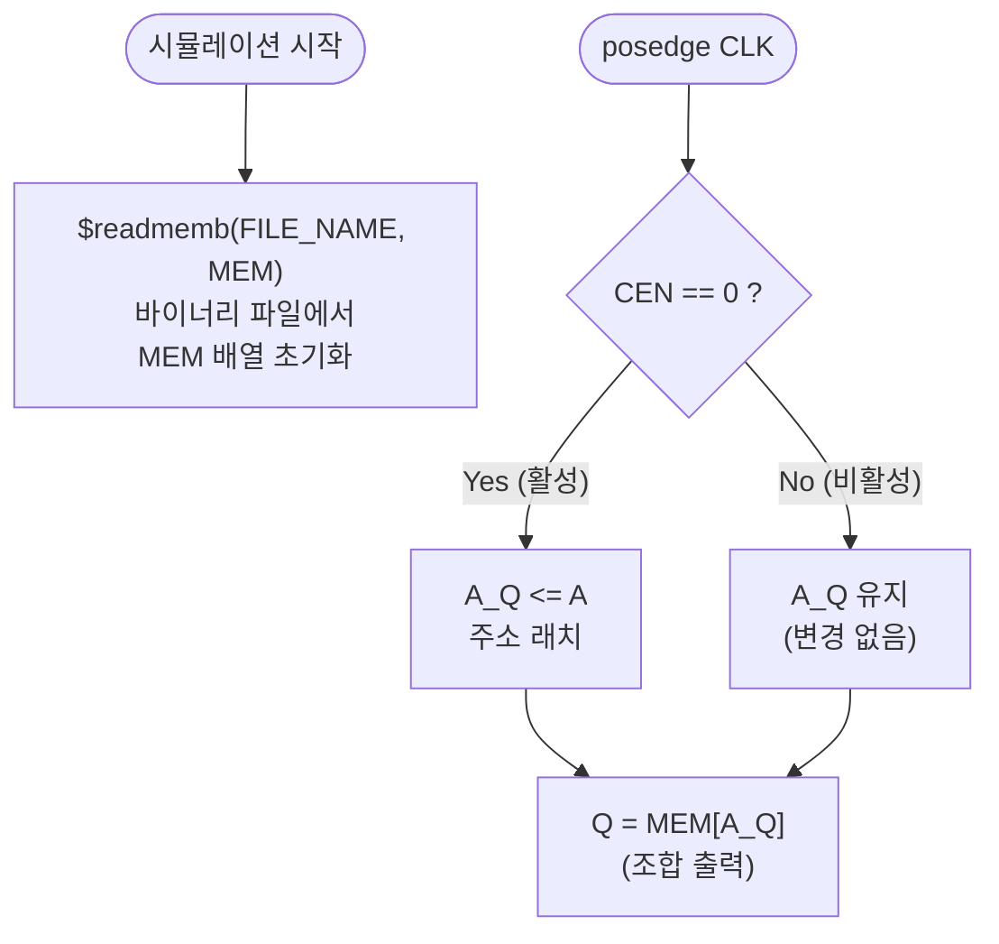
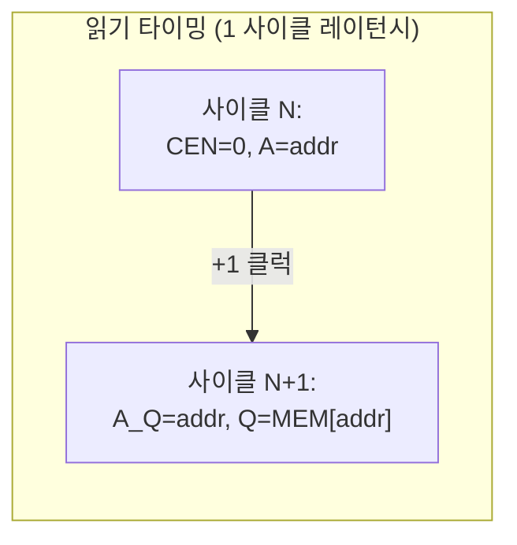

# generic_rom.sv

레거시 범용 ROM 행동 모델입니다. 파일에서 초기화 데이터를 로드하는 단순 동기 ROM입니다.

> **Deprecated** — 신규 설계에서는 공정별 ROM 셀이나 초기화된 SRAM을 사용하세요.

## 모듈 구조

## 파라미터

| 파라미터 | 기본값 | 설명 |
|----------|--------|------|
| `ADDR_WIDTH` | 32 | 주소 비트 폭. `NUM_WORDS = 2^ADDR_WIDTH` |
| `DATA_WIDTH` | 32 | 데이터 비트 폭 |
| `FILE_NAME` | `"./boot/boot_code.cde"` | 초기화 바이너리 파일 경로 (`$readmemb`) |

## 포트

| 포트 | 방향 | 폭 | 설명 |
|------|------|----|------|
| `CLK` | input | 1 | 클럭 (상승 에지) |
| `CEN` | input | 1 | 칩 인에이블 (active-low: `0`=활성) |
| `A` | input | `ADDR_WIDTH` | 읽기 주소 |
| `Q` | output | `DATA_WIDTH` | 읽기 데이터 |

## 읽기 동작 흐름

## 타이밍 특성

- **레이턴시**: 1 클럭 사이클 (주소 래치 후 조합 출력)
- **출력**: `Q`는 `A_Q`에서 조합 논리로 즉시 구동 (추가 레지스터 없음)

## 메모리 구성

| 항목 | 값 |
|------|----|
| 워드 수 | `NUM_WORDS = 2^ADDR_WIDTH` |
| 초기화 방식 | `$readmemb` (바이너리 텍스트 파일) |
| 쓰기 | 없음 (읽기 전용) |

## 관련 파일

- [`generic_memory.sv`](generic_memory.sv.md) — 쓰기 가능한 레거시 범용 메모리
- [`../rtl/tc_sram.sv`](../rtl/tc_sram.sv.md) — 현재 권장 SRAM (초기화 지원 포함)
