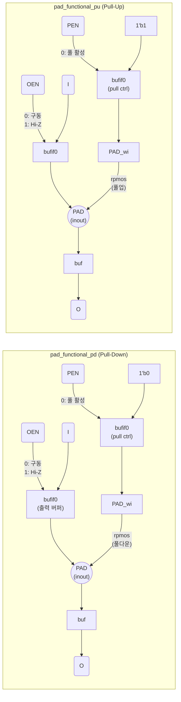
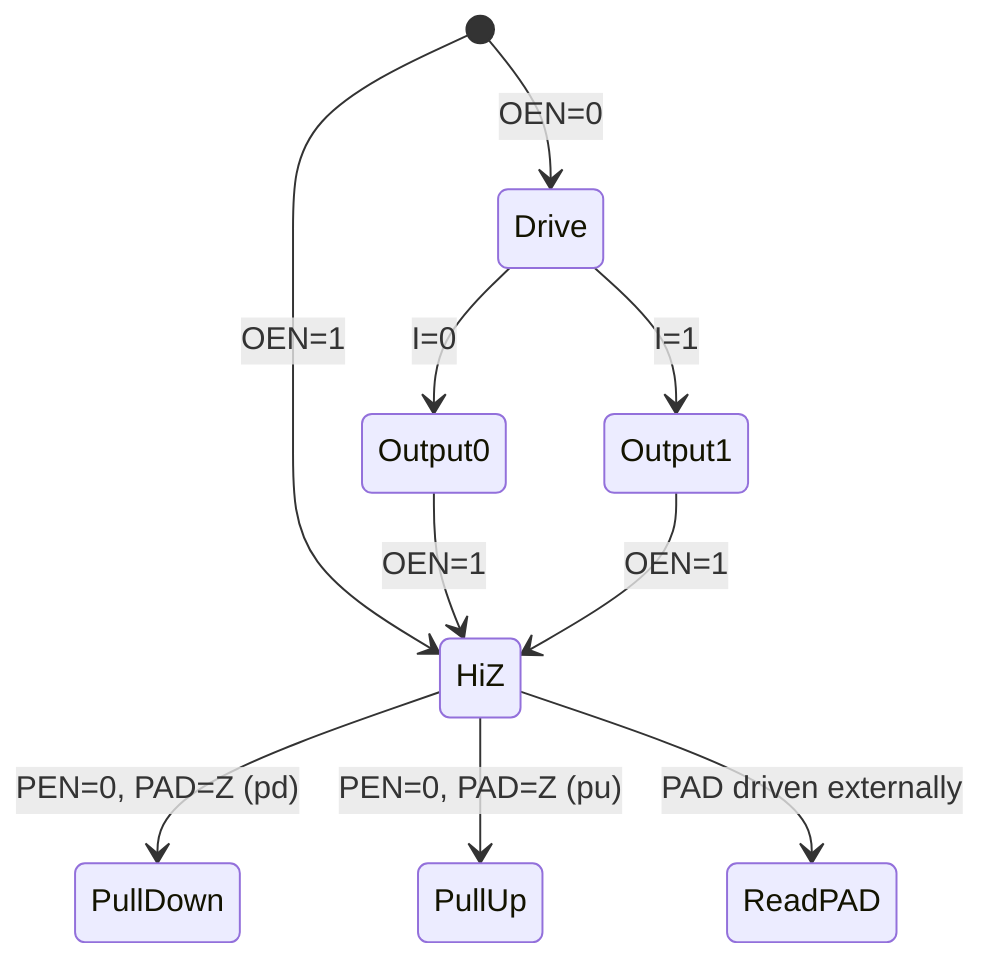

# pad_functional.sv

I/O 패드 기능 셀의 행동 모델입니다. Verilog 1995 게이트 프리미티브를 사용하여 구현되어 있습니다.

> **Deprecated** — FPGA 구현 시 [`src/fpga/pad_functional_xilinx.sv`](../fpga/pad_functional_xilinx.sv.md)를 사용하세요.  
> **Verilator 비호환** — `pmos`/`rpmos` 프리미티브가 Verilator에서 지원되지 않습니다.

## 블록 다이어그램



## 내부 프리미티브 구성

```
bufif0 (PAD, I, OEN);        // OEN=0: I → PAD 구동, OEN=1: Hi-Z
buf    (O, PAD);              // PAD → O 읽기 (항상)
bufif0 (PAD_wi, 1'b0/1, PEN);// PEN=0: 풀 신호 활성
rpmos  (PAD, PAD_wi, 1'b0);  // 저항성 pmos: PAD_wi → PAD (풀 저항)
```

## 동작 진리표

### `pad_functional_pd` (Pull-Down)

| OEN | I | PAD (외부) | PEN | PAD 상태 | O |
|-----|---|-----------|-----|----------|---|
| 0 | 0 | — | x | **0** (구동) | 0 |
| 0 | 1 | — | x | **1** (구동) | 1 |
| 1 | x | 0 | x | 0 | 0 |
| 1 | x | 1 | x | 1 | 1 |
| 1 | x | Z | 0 | **L** (풀다운) | L |
| 1 | x | Z | 1 | — | X |

### `pad_functional_pu` (Pull-Up)

`pad_functional_pd`와 동일 구조. PAD=Z, PEN=0 시 `H`(풀업)로 동작.

## 타이밍/상태 다이어그램



## Verilator 비호환 이유

`rpmos`는 Verilog 1995 스위치 레벨 프리미티브로, Verilator가 지원하지 않습니다. 이 파일은 Bender의 `tech_cells_generic_exclude_deprecated` 타겟을 통해 Verilator 시뮬레이션에서 제외됩니다.

## 관련 파일

- [`../fpga/pad_functional_xilinx.sv`](../fpga/pad_functional_xilinx.sv.md) — Xilinx FPGA 구현체 (`IOBUF` 사용)
