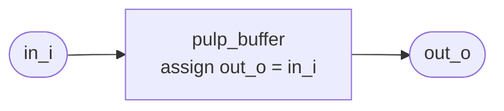
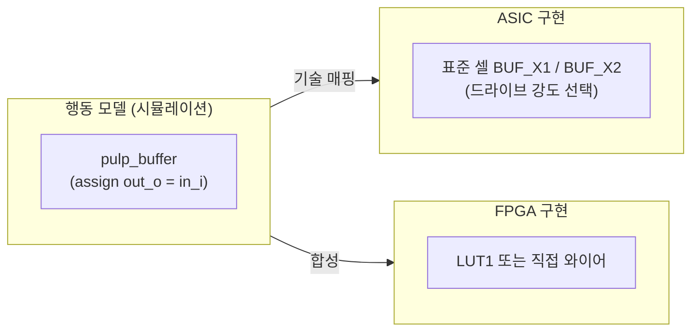

# pulp_buffer.sv

단순 신호 버퍼 셀의 행동 모델입니다. 입력 신호를 출력으로 그대로 전달하는 feedthrough 연결입니다.

> **Deprecated** — 신규 설계에서는 표준 셀 라이브러리의 버퍼 셀이나 직접 와이어 연결을 사용하세요.

## 모듈 구조



## 포트

| 포트 | 방향 | 폭 | 설명 |
|------|------|----|------|
| `in_i` | input | 1 | 입력 신호 |
| `out_o` | output | 1 | 출력 신호 (feedthrough) |

## 구현

```verilog
assign out_o = in_i;
```

단순 조합 연결입니다. 전파 지연 없음.

## ASIC/FPGA 대체 관계



- `src_files.yml`의 `tech_cells_rtl` 그룹에 `skip_synthesis` 플래그가 설정되어 있으므로, 이 파일은 **시뮬레이션에서만** 사용됩니다.
- `tech_cells_fpga` 그룹에도 포함되어 Xilinx 환경에서 재사용됩니다.

## 관련 파일

- [`pulp_clk_cells.sv`](pulp_clk_cells.sv.md) — `tc_clk_buffer`를 래핑하는 클럭 전용 버퍼
- [`../rtl/tc_clk.sv`](../rtl/tc_clk.sv.md) — 현재 권장 클럭 버퍼 (`tc_clk_buffer`)
