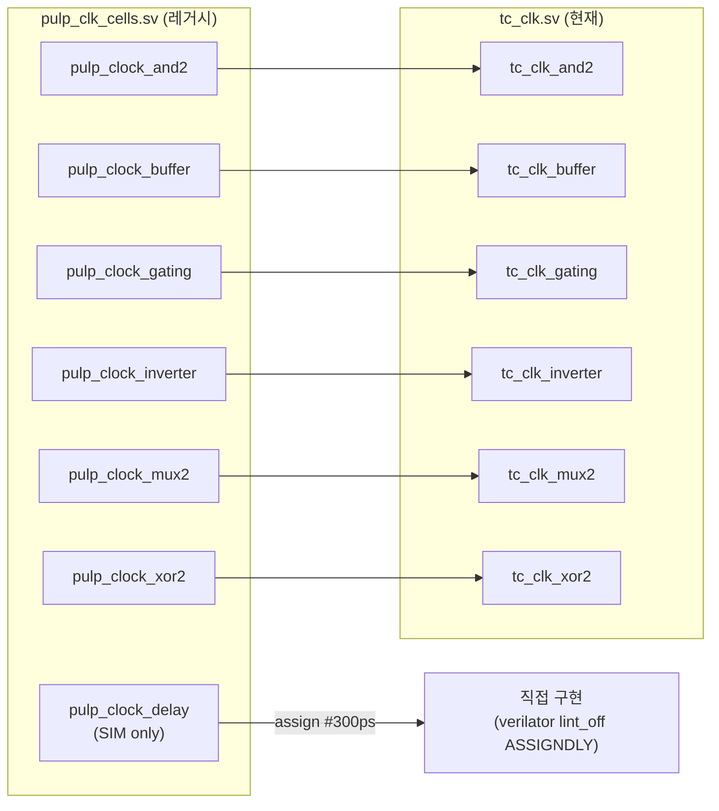
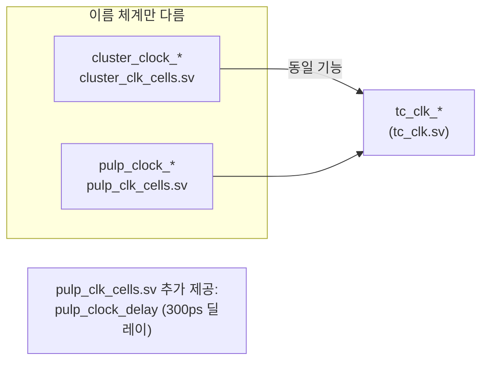

# pulp_clk_cells.sv

`pulp_clock_*` 이름 체계를 사용하는 레거시 클럭 셀 래퍼 모음입니다. 내부적으로 [`src/rtl/tc_clk.sv`](../rtl/tc_clk.sv.md)의 `tc_clk_*` 셀을 인스턴스화합니다.

> **Deprecated** — 신규 설계에서는 `tc_clk_*` 셀을 직접 사용하세요.

## 래핑 구조

## 포함 모듈

| 레거시 모듈 | 내부 인스턴스 | 비고 |
|------------|-------------|------|
| `pulp_clock_and2` | `tc_clk_and2` | |
| `pulp_clock_buffer` | `tc_clk_buffer` | |
| `pulp_clock_gating` | `tc_clk_gating` | |
| `pulp_clock_inverter` | `tc_clk_inverter` | |
| `pulp_clock_mux2` | `tc_clk_mux2` | |
| `pulp_clock_xor2` | `tc_clk_xor2` | |
| `pulp_clock_delay` | 직접 구현 | ``\`ifndef SYNTHESIS`` 가드, Verilator에서 딜레이 무시 |

## `cluster_clk_cells.sv`와의 차이

## 관련 파일

- [`../rtl/tc_clk.sv`](../rtl/tc_clk.sv.md) — 현재 권장 클럭 셀
- [`cluster_clk_cells.sv`](cluster_clk_cells.sv.md) — 동일한 `cluster_clock_*` 레거시 래퍼
- [`pulp_clock_gating_async.sv`](pulp_clock_gating_async.sv.md) — `pulp_clock_gating`을 사용하는 비동기 게이팅 셀
