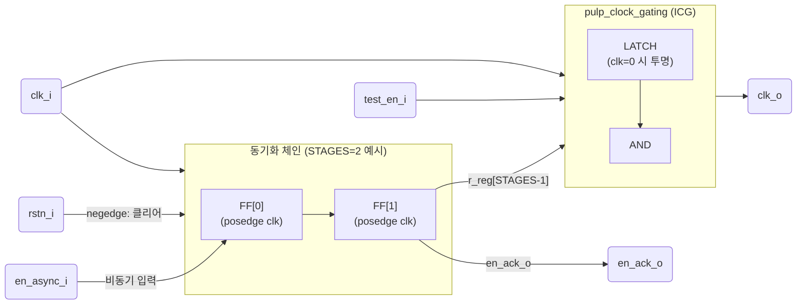

# pulp_clock_gating_async.sv

비동기 인에이블 신호를 동기화하는 클럭 게이팅 셀입니다. 다단 플립플롭으로 비동기 enable을 동기화한 뒤 `pulp_clock_gating`(ICG)으로 클럭을 게이팅합니다.

> Bender.yml에서 타겟 조건 없이 항상 포함됩니다 (`tech_cells_generic_exclude_deprecated`로도 제외 불가).

## 블록 다이어그램



## 타이밍 다이어그램

```
clk:        ___/‾\___/‾\___/‾\___/‾\___/‾\___
rstn:       ‾‾‾‾‾‾‾‾‾‾‾‾‾‾‾‾‾‾‾‾‾‾‾‾‾‾‾‾‾‾‾‾
en_async:   ______/‾‾‾‾‾‾‾‾‾‾‾‾‾‾‾‾‾‾‾‾‾‾‾\__  ← 비동기 변화
r_reg[0]:   _________/‾‾‾‾‾‾‾‾‾‾‾‾‾‾‾‾‾‾‾\__  ← 1 사이클 지연
r_reg[1]:   ____________/‾‾‾‾‾‾‾‾‾‾‾‾‾‾‾‾\__  ← 2 사이클 지연 (동기화 완료)
en_ack_o:   ____________/‾‾‾‾‾‾‾‾‾‾‾‾‾‾‾‾\__  = r_reg[STAGES-1]
clk_o:      ______________/‾\___/‾\___/‾\____  ← 게이팅된 클럭
```

## 모듈: `pulp_clock_gating_async`

### 파라미터

| 파라미터 | 기본값 | 설명 |
|----------|--------|------|
| `STAGES` | 2 | 동기화 플립플롭 단 수 (메타스태빌리티 해소) |

### 포트

| 포트 | 방향 | 설명 |
|------|------|------|
| `clk_i` | input | 클럭 |
| `rstn_i` | input | 비동기 리셋 (active low) |
| `en_async_i` | input | 비동기 인에이블 신호 (다른 클럭 도메인에서 올 수 있음) |
| `en_ack_o` | output | 동기화 완료 인에이블 (`r_reg[STAGES-1]`) |
| `test_en_i` | input | 테스트 인에이블 (DFT 스캔용) |
| `clk_o` | output | 게이팅된 클럭 출력 |

### 내부 동작

```systemverilog
// 동기화 체인
always_ff @(posedge clk_i or negedge rstn_i) begin
    if (!rstn_i) r_reg <= '0;
    else         r_reg <= {r_reg[STAGES-2:0], en_async_i};
end

assign en_ack_o = r_reg[STAGES-1];

// ICG
pulp_clock_gating i_clk_gate (
    .clk_i, .en_i(r_reg[STAGES-1]), .test_en_i, .clk_o
);
```

## 메타스태빌리티 해소


`STAGES=2`로 설정 시 두 번째 플립플롭에서 메타스태빌리티가 해소된 안정적인 신호가 ICG에 입력됩니다.

## 관련 파일

- [`pulp_clk_cells.sv`](pulp_clk_cells.sv.md) — `pulp_clock_gating` 정의
- [`../rtl/tc_clk.sv`](../rtl/tc_clk.sv.md) — `tc_clk_gating` (기본 ICG 셀)
