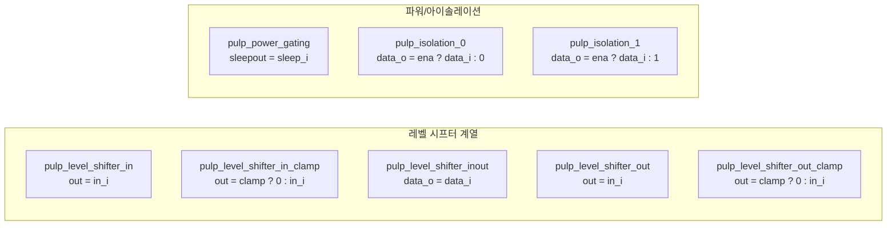

# pulp_pwr_cells.sv

`pulp_*` 이름 체계를 사용하는 레거시 전력 셀 모음입니다. 행동 모델로 단순 조합 논리로 구현됩니다.

> **Deprecated** — 신규 설계에서는 [`src/tc_pwr.sv`](../tc_pwr.sv.md)의 `tc_pwr_*` 셀을 사용하세요.

## 셀 구조

## 포함 모듈 및 `tc_pwr` 매핑

| 레거시 모듈 | `tc_pwr.sv` 대응 |
|------------|-----------------|
| `pulp_level_shifter_in` | `tc_pwr_level_shifter_in` |
| `pulp_level_shifter_in_clamp` | `tc_pwr_level_shifter_in_clamp_lo` |
| `pulp_level_shifter_inout` | — (양방향 feedthrough) |
| `pulp_level_shifter_out` | `tc_pwr_level_shifter_out` |
| `pulp_level_shifter_out_clamp` | `tc_pwr_level_shifter_out_clamp_lo` |
| `pulp_power_gating` | `tc_pwr_power_gating` |
| `pulp_isolation_0` | `tc_pwr_isolation_lo` |
| `pulp_isolation_1` | `tc_pwr_isolation_hi` |

## 관련 파일

- [`../tc_pwr.sv`](../tc_pwr.sv.md) — 현재 권장 전력 셀
- [`cluster_pwr_cells.sv`](cluster_pwr_cells.sv.md) — 동일한 `cluster_*` 레거시 래퍼
