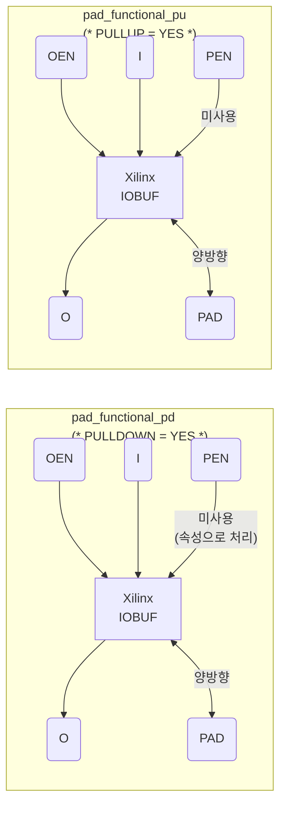
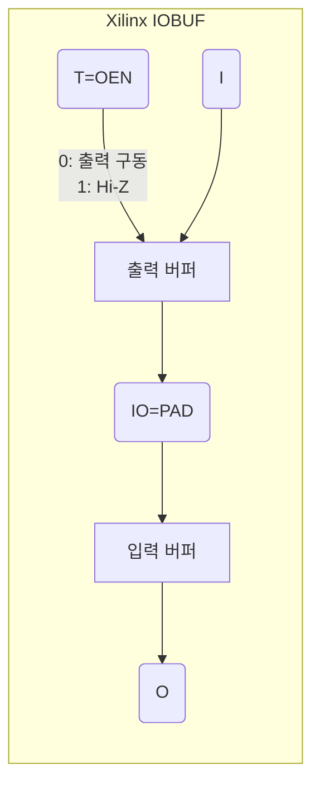
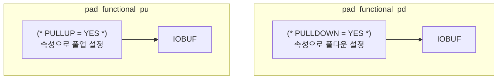

# pad_functional_xilinx.sv

Xilinx FPGA용 I/O 패드 기능 셀입니다. [`src/deprecated/pad_functional.sv`](../deprecated/pad_functional.sv.md)의 FPGA 구현체로, Xilinx `IOBUF` 프리미티브를 사용합니다.

## 블록 다이어그램

## IOBUF 동작 원리

| OEN(T) | I | PAD 외부 값 | O | PAD |
|--------|---|------------|---|-----|
| 0 | 0 | - | 0 | **0** (구동) |
| 0 | 1 | - | 1 | **1** (구동) |
| 1 | x | 0 | 0 | Hi-Z (풀 적용) |
| 1 | x | 1 | 1 | Hi-Z (풀 적용) |
| 1 | x | Z | 0(PD)/1(PU) | **풀 저항** |

## 풀 저항 구현 방식

RTL 행동 모델은 `rpmos` 프리미티브로 풀 저항을 구현하지만, FPGA 버전은 Xilinx 합성 속성(`PULLDOWN`/`PULLUP`)으로 처리합니다.

## RTL 행동 모델과의 차이

| 항목 | RTL (`pad_functional.sv`) | Xilinx (`pad_functional_xilinx.sv`) |
|------|--------------------------|-------------------------------------|
| 풀 저항 | `rpmos` 게이트 프리미티브 | `(* PULLDOWN/PULLUP = "YES" *)` 속성 |
| 출력 | `bufif0` 프리미티브 | `IOBUF.T` 제어 |
| Verilator | ❌ 미지원 (`pmos`) | ✅ 지원 가능 |

## 관련 파일

- [`../deprecated/pad_functional.sv`](../deprecated/pad_functional.sv.md) — RTL 행동 모델
- [`tc_clk_xilinx.sv`](tc_clk_xilinx.sv.md) — Xilinx 클럭 셀
