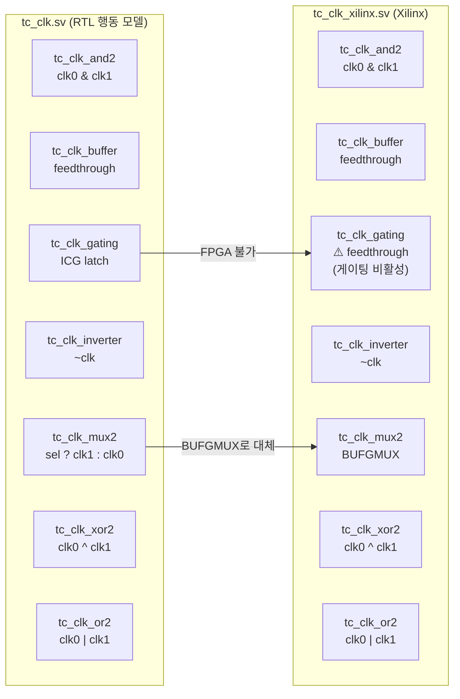
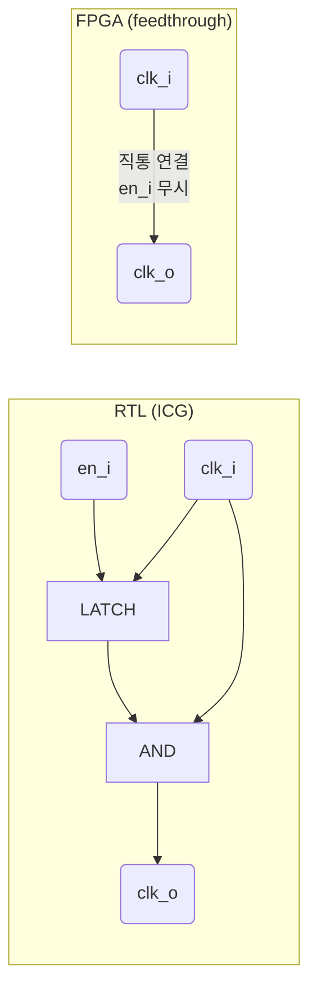
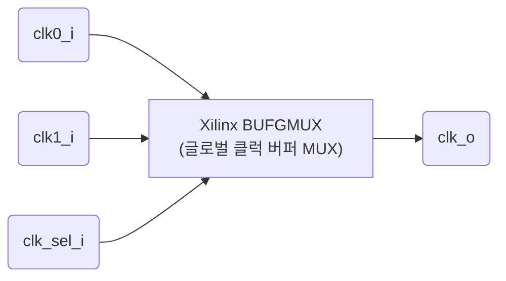

# tc_clk_xilinx.sv

Xilinx FPGA 구현을 위한 클럭 셀 모음입니다. [`src/rtl/tc_clk.sv`](../rtl/tc_clk.sv.md)와 동일한 모듈 인터페이스를 제공하며, FPGA 합성 시 이 파일로 대체됩니다.

## RTL vs Xilinx 구현 비교

## `tc_clk_gating` — FPGA에서의 비활성화

> FPGA의 클럭 네트워크 구조가 ASIC ICG와 달리 동작하므로, 예상치 못한 글리치나 타이밍 문제를 방지하기 위해 feedthrough로 처리합니다.

## `tc_clk_mux2` — `BUFGMUX` 프리미티브

`BUFGMUX`는 Xilinx 글로벌 클럭 라우팅 네트워크를 사용하여 전체 FPGA에 저 스큐로 클럭을 분배합니다.

## 포함 모듈 요약

| 모듈 | Xilinx 구현 | RTL 대비 차이 |
|------|-------------|---------------|
| `tc_clk_and2` | `assign clk_o = clk0_i & clk1_i` | 동일 |
| `tc_clk_buffer` | `assign clk_o = clk_i` | 동일 |
| `tc_clk_gating` | `assign clk_o = clk_i` | **게이팅 비활성화** |
| `tc_clk_inverter` | `assign clk_o = ~clk_i` | 동일 |
| `tc_clk_mux2` | `BUFGMUX` 프리미티브 | **글로벌 클럭 라우팅** |
| `tc_clk_xor2` | `assign clk_o = clk0_i ^ clk1_i` | 동일 |
| `tc_clk_or2` | `assign clk_o = clk0_i \| clk1_i` | 동일 |

> `tc_clk_delay`는 포함되지 않습니다 (시뮬레이션 전용).

## 관련 파일

- [`../rtl/tc_clk.sv`](../rtl/tc_clk.sv.md) — RTL 행동 모델
- [`tc_sram_xilinx.sv`](tc_sram_xilinx.sv.md) — Xilinx SRAM 구현체
- [`pad_functional_xilinx.sv`](pad_functional_xilinx.sv.md) — Xilinx 패드 셀
