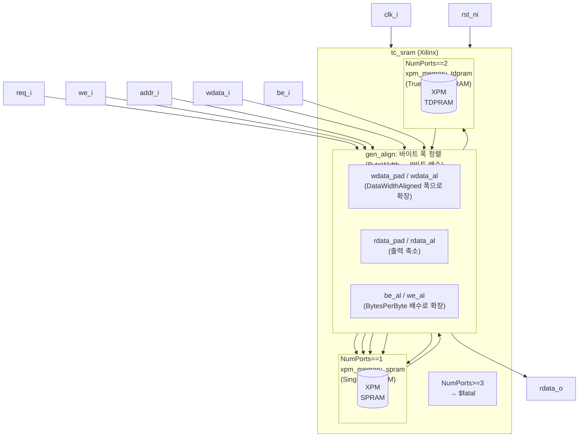
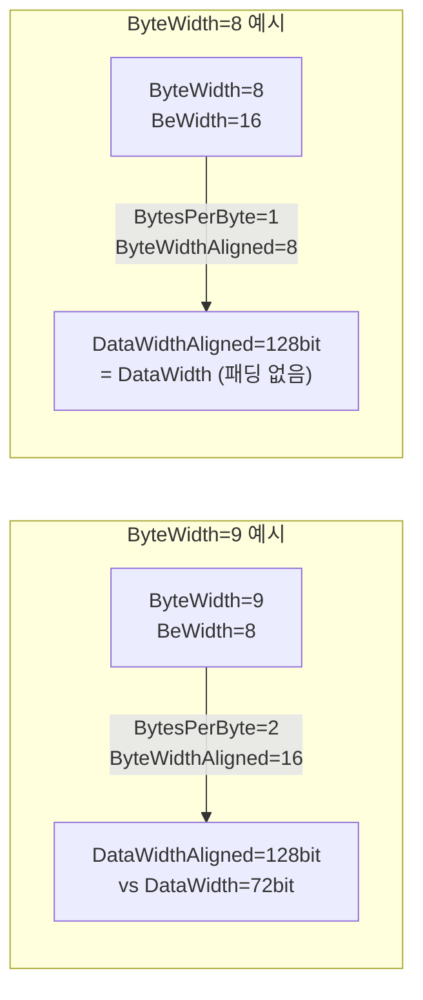
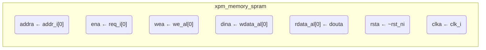
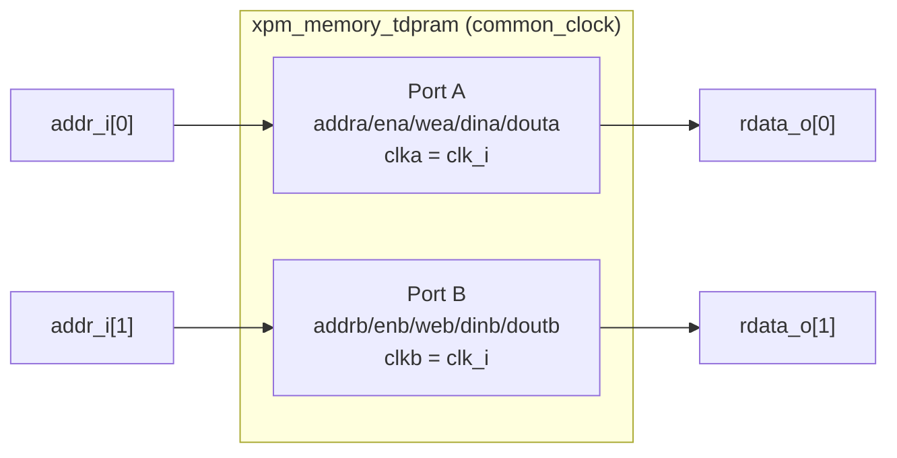

# tc_sram_xilinx.sv

Xilinx XPM(Xilinx Parameterized Macro)을 사용한 `tc_sram` FPGA 구현체입니다. `tc_sram`과 동일한 인터페이스를 제공하며, Vivado에서 FPGA 합성 시 이 파일이 사용됩니다.

## 전체 블록 다이어그램



## 바이트 폭 정렬 상세

XPM은 8비트 바이트 단위만 지원하므로 `ByteWidth`를 8의 배수로 확장합니다.

```
BytesPerByte     = ceil(ByteWidth / 8)
ByteWidthAligned = BytesPerByte × 8
DataWidthAligned = ByteWidthAligned × BeWidth
Size (bits)      = NumWords × DataWidthAligned
```



## XPM 매핑

### NumPorts = 1 → `xpm_memory_spram`



| XPM 파라미터 | 값 | 설명 |
|-------------|-----|------|
| `MEMORY_PRIMITIVE` | `FPGAImplKey` | `"auto"` / `"block"` / `"ultra"` / `"distributed"` |
| `MEMORY_SIZE` | `NumWords × DataWidthAligned` | 비트 단위 전체 크기 |
| `READ_LATENCY_A` | `Latency` | 읽기 레이턴시 |
| `BYTE_WRITE_WIDTH_A` | 8 | XPM 고정값 |
| `WRITE_MODE_A` | `"no_change"` | 쓰기 시 출력 유지 |

### NumPorts = 2 → `xpm_memory_tdpram`



포트 A와 B 모두 동일한 `clk_i`를 사용합니다(`CLOCKING_MODE = "common_clock"`).

## 파라미터

| 파라미터 | 기본값 | 설명 |
|----------|--------|------|
| `NumWords` | 1024 | 메모리 워드 수 |
| `DataWidth` | 128 | 데이터 비트 폭 |
| `ByteWidth` | 8 | 바이트 비트 폭 |
| `NumPorts` | 2 | 포트 수 (1 또는 2만 지원) |
| `Latency` | 1 | 읽기 레이턴시 |
| `SimInit` | `"zeros"` | 항상 0으로 초기화 (XPM 제약) |
| `FPGAImplKey` | `"auto"` | XPM 메모리 프리미티브 타입 |

## 제약사항

- `SimInit`은 `"zeros"` 고정 (XPM 초기화 항상 0)
- `NumPorts`는 1 또는 2만 지원 (3 이상 시 `$fatal`)
- Vivado에서 XPM 인식을 위해 필요:
  ```tcl
  set_property XPM_LIBRARIES XPM_MEMORY [current_project]
  # 또는
  auto_detect_xpm
  ```

## 관련 파일

- [`../rtl/tc_sram.sv`](../rtl/tc_sram.sv.md) — RTL 행동 모델
- [`tc_clk_xilinx.sv`](tc_clk_xilinx.sv.md) — Xilinx 클럭 셀
- [`../../scripts/vivado/run_xsim.tcl`](../../scripts/vivado/run_xsim.tcl.md) — Vivado 시뮬레이션 스크립트
