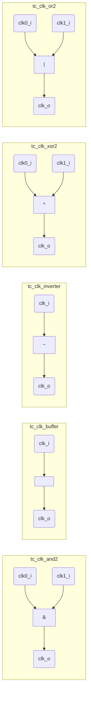
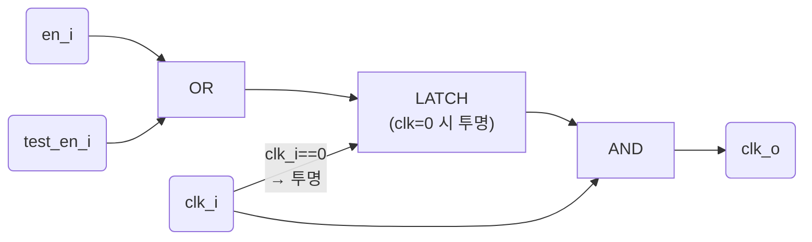
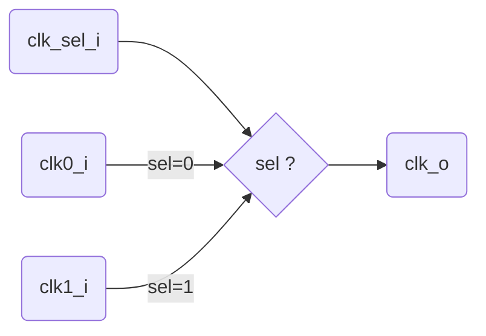
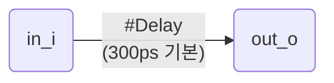
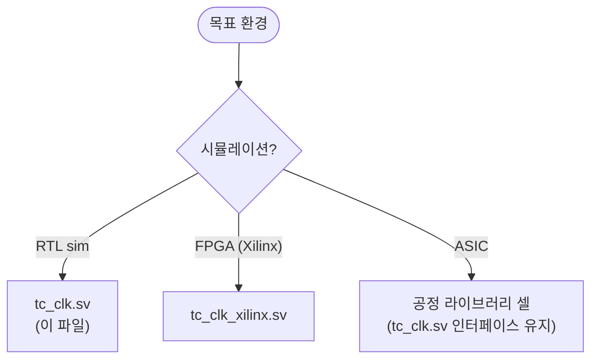

# tc_clk.sv

클럭 관련 기술 셀(technology cell)들의 행동 모델(behavioral model) 모음입니다. RTL 시뮬레이션용이며, ASIC 구현 시 해당 공정 라이브러리의 실제 셀로 대체됩니다.

## 셀 구조 일람



## `tc_clk_gating` 상세 (ICG)



**핵심 원리**: 클럭이 LOW일 때만 enable 신호를 래치에 통과시킵니다. 따라서 클럭이 HIGH로 전환될 때 enable 값이 안정적으로 AND 게이트에 입력되어 글리치가 발생하지 않습니다.

### 타이밍 다이어그램

```
clk_i:   ___/‾‾‾\___/‾‾‾\___/‾‾‾\___/‾‾‾\
en_i:    _________/‾‾‾‾‾‾‾‾‾‾‾‾‾‾‾\______
clk_en:  ___________/‾‾‾‾‾‾‾‾‾‾‾‾‾\______   ← clk LOW에서 en 래치
clk_o:   _____________/‾‾‾\___/‾‾‾\______   ← 글리치 없이 게이팅
```

## `tc_clk_mux2` 상세



> ⚠️ **경고**: 이 셀은 준정적(quasi-static) 전환 전용입니다. 동적 클럭 전환 시 글리치가 발생할 수 있습니다. 동적 전환에는 `common_cells`의 `clk_mux_glitch_free`를 사용하세요.

## `tc_clk_delay` (시뮬레이션 전용)



컴파일 가드:
```
`ifndef SYNTHESIS    → 합성 시 제외
  `ifndef VERILATOR  → Verilator 시 제외 (assign #delay 미지원)
    assign #(Delay) out_o = in_i;
  `endif
`endif
```

## 포함 모듈 요약

| 모듈 | 동작 | 파라미터 | 합성 포함 |
|------|------|----------|-----------|
| `tc_clk_and2` | `clk_o = clk0_i & clk1_i` | 없음 | ✅ |
| `tc_clk_buffer` | `clk_o = clk_i` | 없음 | ✅ |
| `tc_clk_gating` | latch(en\|test_en) & clk | `IS_FUNCTIONAL` | ✅ |
| `tc_clk_inverter` | `clk_o = ~clk_i` | 없음 | ✅ |
| `tc_clk_mux2` | `clk_o = sel ? clk1 : clk0` | 없음 | ✅ |
| `tc_clk_xor2` | `clk_o = clk0_i ^ clk1_i` | 없음 | ✅ |
| `tc_clk_or2` | `clk_o = clk0_i \| clk1_i` | 없음 | ✅ |
| `tc_clk_delay` | `#Delay` 지연 | `Delay` (time) | ❌ (시뮬레이션 전용) |

## 파일 선택 기준



## 레거시 래퍼

- [`../deprecated/cluster_clk_cells.sv`](../deprecated/cluster_clk_cells.sv.md) — `cluster_clock_*` 이름으로 래핑
- [`../deprecated/pulp_clk_cells.sv`](../deprecated/pulp_clk_cells.sv.md) — `pulp_clock_*` 이름으로 래핑

## 관련 파일

- [`../fpga/tc_clk_xilinx.sv`](../fpga/tc_clk_xilinx.sv.md) — Xilinx FPGA 구현체
