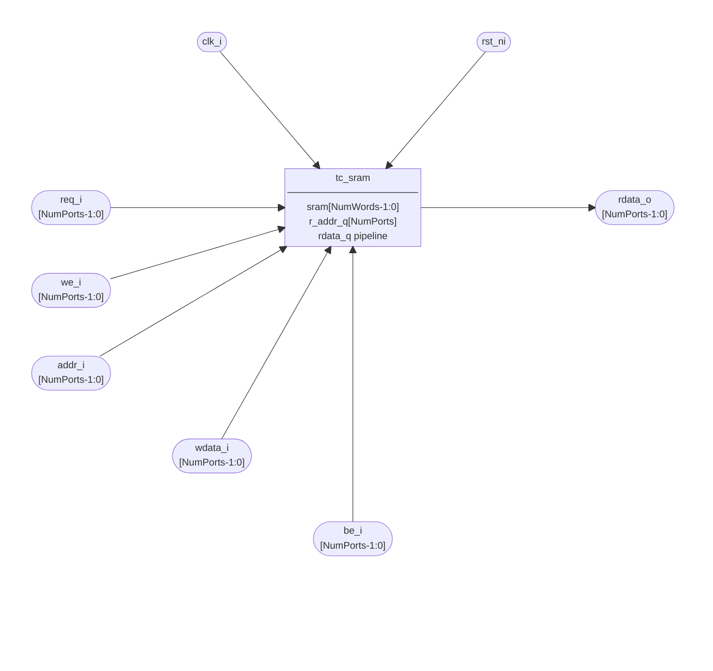
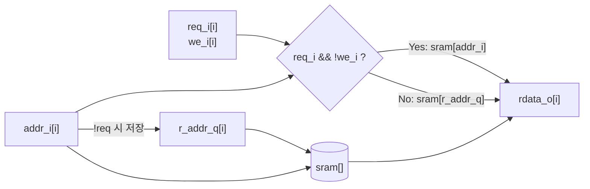
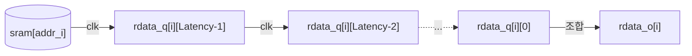
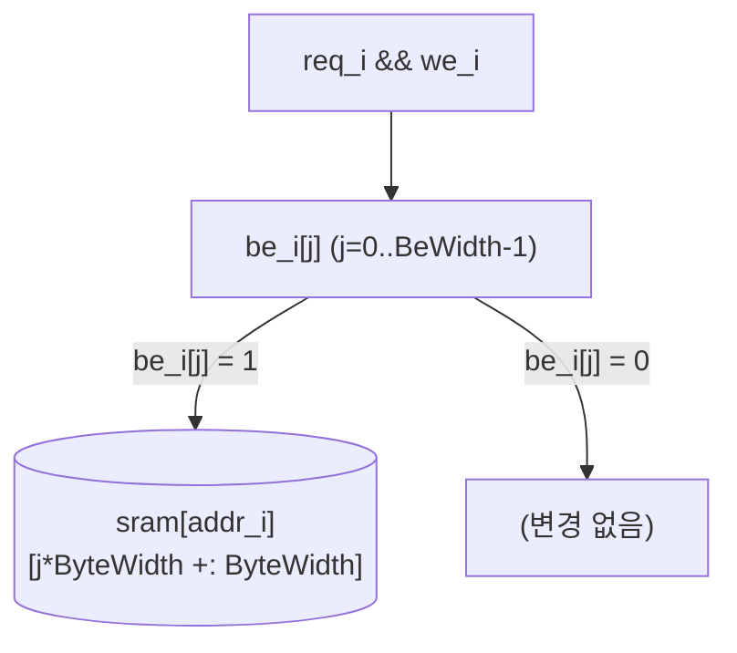
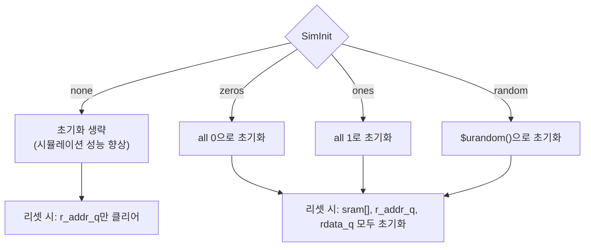

# tc_sram.sv

설정 가능한 범용 SRAM의 행동 모델(behavioral model)입니다. RTL 시뮬레이션용이며, ASIC 구현 시 공정별 메모리 매크로로 대체됩니다.

## 블록 다이어그램



## 내부 아키텍처

### Latency = 0 경로



### Latency > 0 파이프라인



### 쓰기 동작 (Byte Enable)



## 모듈: `tc_sram`

### 파라미터

| 파라미터 | 기본값 | 설명 |
|----------|--------|------|
| `NumWords` | 1024 | 메모리 워드 수. 주소 폭 = `$clog2(NumWords)` |
| `DataWidth` | 128 | 데이터 비트 폭 |
| `ByteWidth` | 8 | 바이트 비트 폭. Byte Enable 폭 = `ceil(DataWidth/ByteWidth)` |
| `NumPorts` | 2 | 읽기/쓰기 포트 수 (각 포트는 풀 포트) |
| `Latency` | 1 | 읽기 레이턴시 (클럭 사이클 수) |
| `SimInit` | `"none"` | 초기화 방식: `"zeros"` / `"ones"` / `"random"` / `"none"` |
| `PrintSimCfg` | 0 | 시뮬레이션 시작 시 설정 정보 출력 여부 |
| `ImplKey` | `"none"` | 구현체 참조 키 (공정별 매핑용) |
| `FPGAImplKey` | `"auto"` | FPGA 구현체 참조 키 |

### 의존 파라미터 (자동 계산)

```
AddrWidth = (NumWords > 1) ? $clog2(NumWords) : 1
BeWidth   = ceil(DataWidth / ByteWidth)
```

### 포트

| 포트 | 방향 | 폭 | 설명 |
|------|------|----|------|
| `clk_i` | input | 1 | 클럭 |
| `rst_ni` | input | 1 | 비동기 리셋 (active low) |
| `req_i` | input | NumPorts | 요청 (active high) |
| `we_i` | input | NumPorts | 쓰기 인에이블 (active high) |
| `addr_i` | input | NumPorts × AddrWidth | 요청 주소 |
| `wdata_i` | input | NumPorts × DataWidth | 쓰기 데이터 |
| `be_i` | input | NumPorts × BeWidth | 바이트 인에이블 (active high) |
| `rdata_o` | output | NumPorts × DataWidth | 읽기 데이터 (`Latency` 사이클 후 유효) |

## 동작 규칙

### 읽기/쓰기 타이밍

```
Clock:   ___/‾‾‾\___/‾‾‾\___/‾‾‾\___
req_i:   ___/‾‾‾‾‾‾‾\_______________   (1사이클 요청)
we_i:    ________/‾‾‾\_______________   (쓰기)
rdata_o: ___________________________/‾‾ (Latency=1 후 유효, 읽기 시)
```

### 주소 충돌 처리

| 상황 | 결과 |
|------|------|
| 포트 0, 포트 1 동시 쓰기 (같은 주소) | 포트 0 먼저 쓰고, 포트 1이 덮어씀 |
| 쓰기 중 읽기 (`we_i=1`) | `rdata_o` 유지 (갱신 없음) |

### SimInit 처리 분기



## Verilator / 합성 가드

```
`ifndef VERILATOR
`ifndef TARGET_SYNTHESIS
  // 아래 블록 활성화:
  // - p_assertions: 파라미터 유효성 immediate assertion
  // - p_sim_hello:  PrintSimCfg=1 시 설정 출력
  // - gen_assertions: 주소 범위 concurrent assertion
`endif
`endif
```

## 관련 파일

- [`tc_sram_impl.sv`](tc_sram_impl.sv.md) — 구현체 IO(`impl_i`/`impl_o`)를 추가한 래퍼
- [`../fpga/tc_sram_xilinx.sv`](../fpga/tc_sram_xilinx.sv.md) — Xilinx XPM 기반 구현체
- [`../../test/tb_tc_sram.sv`](../../test/tb_tc_sram.sv.md) — 기능 검증 테스트벤치
