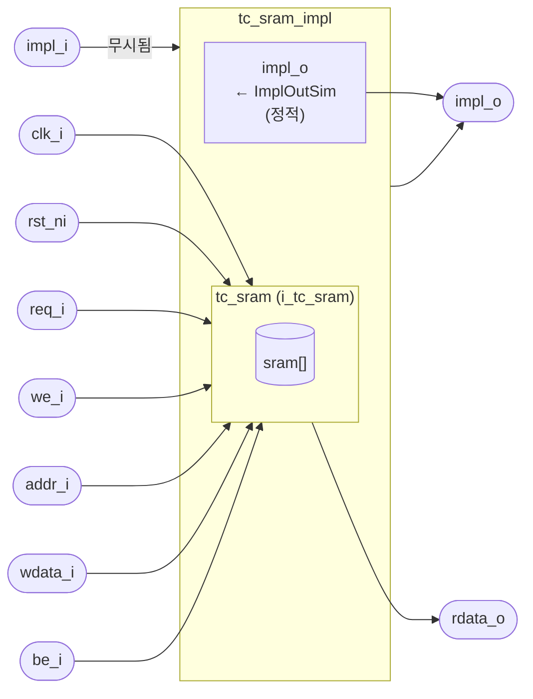
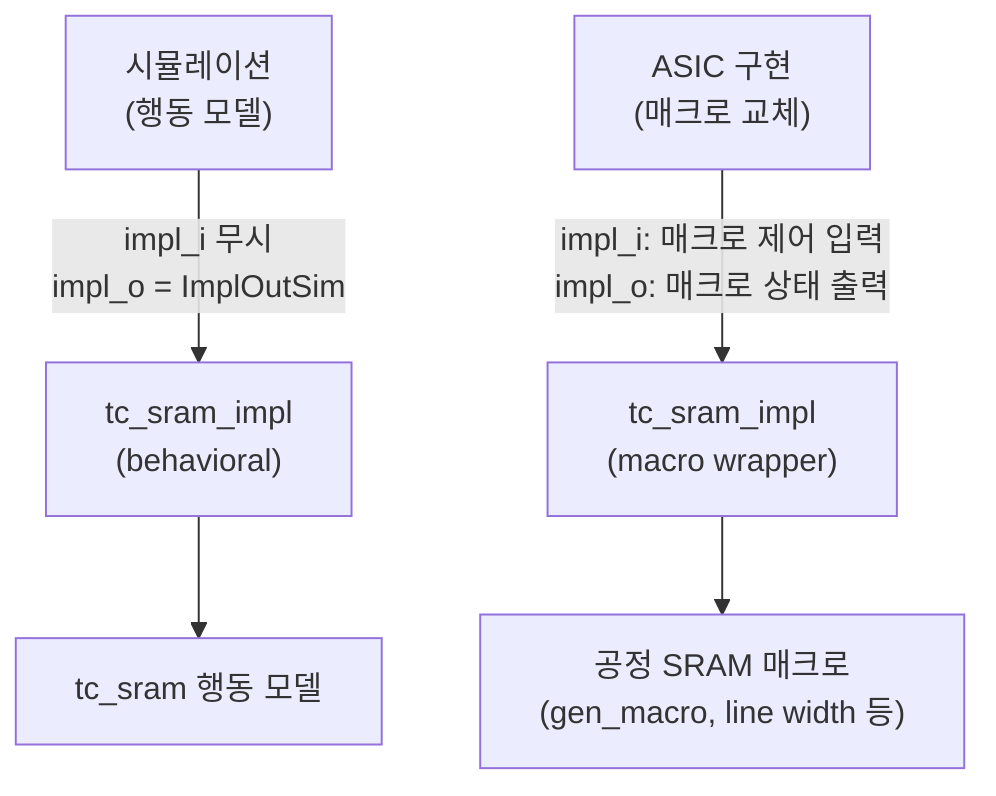

# tc_sram_impl.sv

`tc_sram`에 구현체 관련 입출력 포트(`impl_i`, `impl_o`)를 추가한 래퍼 모듈입니다. 공정별 SRAM 매크로가 pseudo-static 제어 신호를 필요로 할 때 `tc_sram` 대신 직접 교체하여 사용합니다.

## 블록 다이어그램



## 사용 시나리오



## 모듈: `tc_sram_impl`

### 파라미터 (`tc_sram` 공통 파라미터 외 추가)

| 파라미터 | 기본값 | 설명 |
|----------|--------|------|
| `NumWords` | 1024 | 메모리 워드 수 |
| `DataWidth` | 128 | 데이터 비트 폭 |
| `ByteWidth` | 8 | 바이트 비트 폭 |
| `NumPorts` | 2 | 포트 수 |
| `Latency` | 1 | 읽기 레이턴시 |
| `SimInit` | `"none"` | 시뮬레이션 초기화 방식 |
| `PrintSimCfg` | 0 | 설정 출력 여부 |
| `ImplKey` | `"none"` | 구현체 참조 키 |
| `impl_in_t` | `logic` | 구현체 입력 신호 타입 (파라미터 타입) |
| `impl_out_t` | `logic` | 구현체 출력 신호 타입 (파라미터 타입) |
| `ImplOutSim` | `'X` | 행동 시뮬레이션에서 `impl_o`에 구동할 정적 값 |

### 포트 (`tc_sram` 공통 포트 외 추가)

| 포트 | 방향 | 타입 | 설명 |
|------|------|------|------|
| `impl_i` | input | `impl_in_t` | 구현체 관련 입력 (행동 모델에서 무시됨) |
| `impl_o` | output | `impl_out_t` | 구현체 관련 출력 (`ImplOutSim`으로 정적 구동) |

나머지 포트(`clk_i`, `rst_ni`, `req_i`, `we_i`, `addr_i`, `wdata_i`, `be_i`, `rdata_o`)는 [`tc_sram`](tc_sram.sv.md)과 동일합니다.

## 내부 구현

```systemverilog
assign impl_o = ImplOutSim;   // 행동 모델: 정적 값 구동

tc_sram #(
  .NumWords(NumWords), .DataWidth(DataWidth), ...
) i_tc_sram (
  .clk_i, .rst_ni,
  .req_i, .we_i, .addr_i, .wdata_i, .be_i,
  .rdata_o
  // impl_i/impl_o는 tc_sram에 전달되지 않음
);
```

## 관련 파일

- [`tc_sram.sv`](tc_sram.sv.md) — 내부에서 인스턴스화하는 기본 SRAM 모듈
