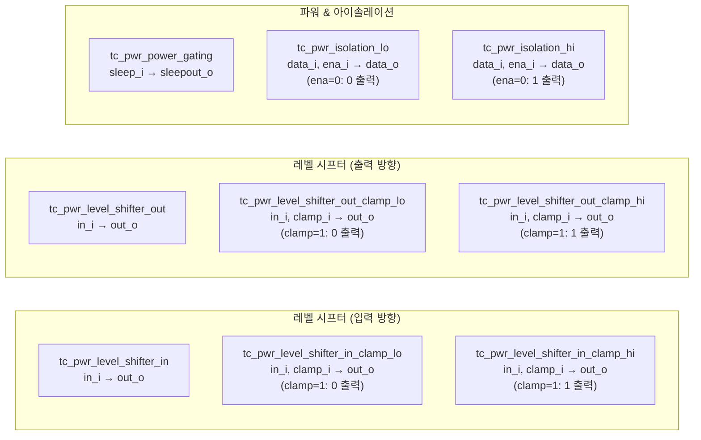
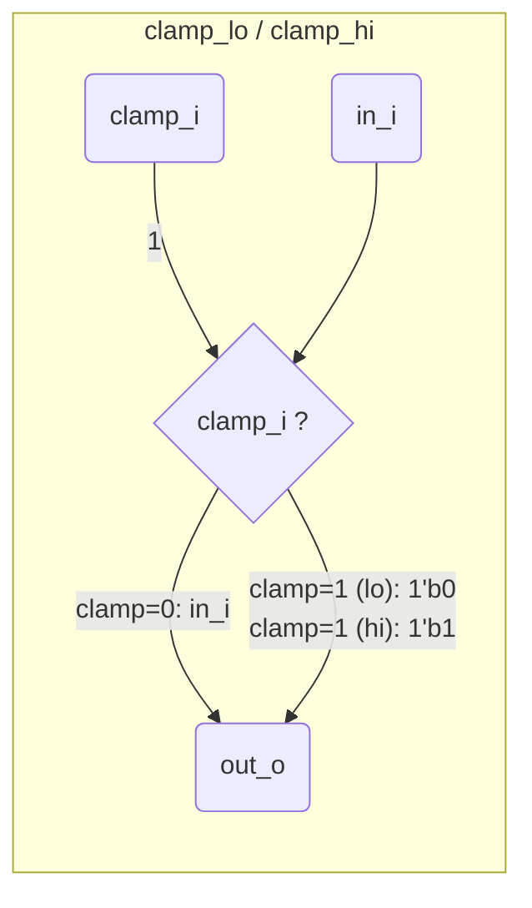
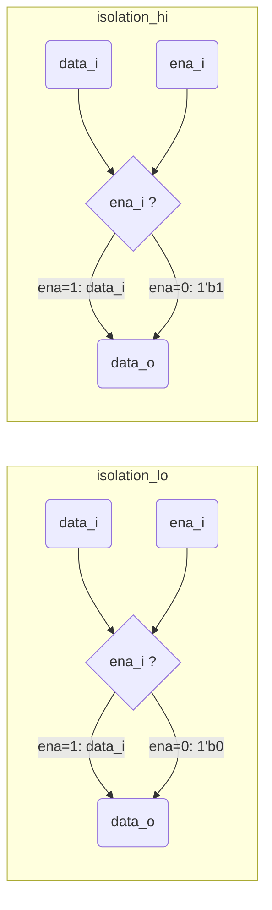
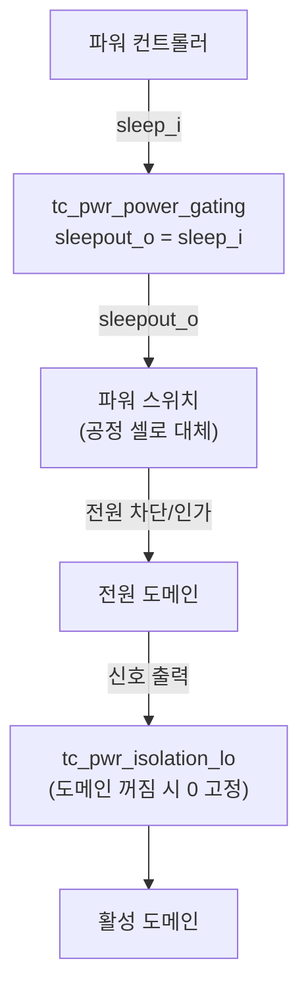

# tc_pwr.sv

전력 관련 기술 셀(technology cell)들의 행동 모델 모음입니다. 레벨 시프터, 파워 게이팅, 아이솔레이션 셀을 포함합니다.

## 전체 셀 구조

## 레벨 시프터 동작

**진리표**

| `clamp_i` | `in_i` | `out_o` (clamp_lo) | `out_o` (clamp_hi) |
|-----------|--------|---------------------|---------------------|
| 0 | 0 | 0 | 0 |
| 0 | 1 | 1 | 1 |
| 1 | x | **0** | **1** |

## 아이솔레이션 셀 동작

**사용 맥락**: 전원이 꺼진 도메인에서 나오는 신호를 안정된 값으로 고정하여 활성 도메인의 오동작을 방지합니다.

## 파워 게이팅 흐름

## 포함 모듈 요약

| 모듈 | 동작 (행동 모델) | 용도 |
|------|-----------------|------|
| `tc_pwr_level_shifter_in` | `out_o = in_i` | 저→고 전압 도메인 입력 |
| `tc_pwr_level_shifter_in_clamp_lo` | `out_o = clamp_i ? 0 : in_i` | 입력 + 저 클램프 |
| `tc_pwr_level_shifter_in_clamp_hi` | `out_o = clamp_i ? 1 : in_i` | 입력 + 고 클램프 |
| `tc_pwr_level_shifter_out` | `out_o = in_i` | 고→저 전압 도메인 출력 |
| `tc_pwr_level_shifter_out_clamp_lo` | `out_o = clamp_i ? 0 : in_i` | 출력 + 저 클램프 |
| `tc_pwr_level_shifter_out_clamp_hi` | `out_o = clamp_i ? 1 : in_i` | 출력 + 고 클램프 |
| `tc_pwr_power_gating` | `sleepout_o = sleep_i` | 파워 게이트 제어 |
| `tc_pwr_isolation_lo` | `data_o = ena_i ? data_i : 0` | 아이솔레이션 (저) |
| `tc_pwr_isolation_hi` | `data_o = ena_i ? data_i : 1` | 아이솔레이션 (고) |

## 레거시 대응

- [`../deprecated/cluster_pwr_cells.sv`](../deprecated/cluster_pwr_cells.sv.md) — `cluster_*` 이름
- [`../deprecated/pulp_pwr_cells.sv`](../deprecated/pulp_pwr_cells.sv.md) — `pulp_*` 이름
