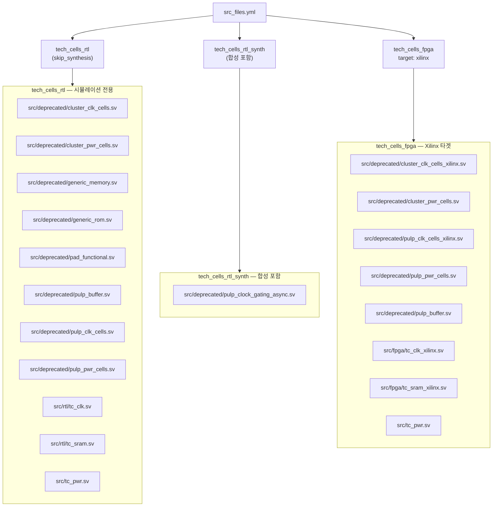
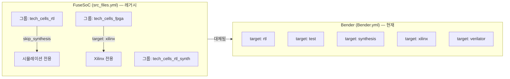

# src_files.yml

FuseSoC 스타일의 소스 파일 목록 파일입니다. Bender 도입 이전의 레거시 형식으로, 파일 그룹별로 합성 제외 플래그와 타겟을 정의합니다.

> **참고** — 현재 주 의존성 관리는 [`Bender.yml`](Bender.yml.md)을 사용합니다. 이 파일은 하위 호환성을 위해 유지됩니다.

## 그룹 구조

## 그룹별 상세

### `tech_cells_rtl`

- **플래그**: `skip_synthesis` — 합성 제외, 시뮬레이션 전용
- **파일** (레거시 + 현재):

| 파일 | 분류 |
|------|------|
| `src/deprecated/cluster_clk_cells.sv` | 레거시 클럭 셀 |
| `src/deprecated/cluster_pwr_cells.sv` | 레거시 전력 셀 |
| `src/deprecated/generic_memory.sv` | 레거시 범용 메모리 |
| `src/deprecated/generic_rom.sv` | 레거시 범용 ROM |
| `src/deprecated/pad_functional.sv` | 레거시 패드 셀 |
| `src/deprecated/pulp_buffer.sv` | 레거시 버퍼 |
| `src/deprecated/pulp_clk_cells.sv` | 레거시 클럭 셀 (pulp_\*) |
| `src/deprecated/pulp_pwr_cells.sv` | 레거시 전력 셀 (pulp_\*) |
| `src/rtl/tc_clk.sv` | 현재 클럭 셀 |
| `src/rtl/tc_sram.sv` | 현재 SRAM 모델 |
| `src/tc_pwr.sv` | 현재 전력 셀 |

### `tech_cells_rtl_synth`

- **플래그**: 없음 (합성 포함)
- **파일**:
  - `src/deprecated/pulp_clock_gating_async.sv` — 비동기 클럭 게이팅 (합성 가능)

### `tech_cells_fpga`

- **타겟**: `xilinx` (Xilinx FPGA 전용)
- **파일**:

| 파일 | 설명 |
|------|------|
| `src/deprecated/cluster_clk_cells_xilinx.sv` | Xilinx 클럭 셀 (cluster_\*) |
| `src/deprecated/cluster_pwr_cells.sv` | 전력 셀 (공용) |
| `src/deprecated/pulp_clk_cells_xilinx.sv` | Xilinx 클럭 셀 (pulp_\*) |
| `src/deprecated/pulp_pwr_cells.sv` | 전력 셀 (공용) |
| `src/deprecated/pulp_buffer.sv` | 버퍼 (공용) |
| `src/fpga/tc_clk_xilinx.sv` | Xilinx 전용 클럭 셀 |
| `src/fpga/tc_sram_xilinx.sv` | XPM 기반 SRAM |
| `src/tc_pwr.sv` | 현재 전력 셀 (공용) |

## FuseSoC vs Bender 비교

## 관련 파일

- [`Bender.yml`](Bender.yml.md) — 현재 권장 의존성 및 소스 관리 파일
