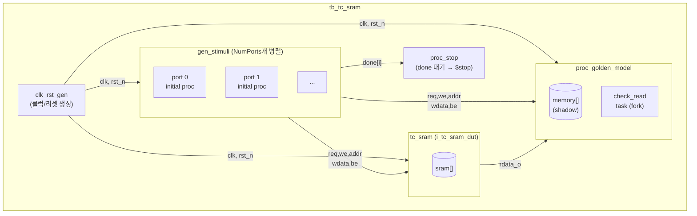
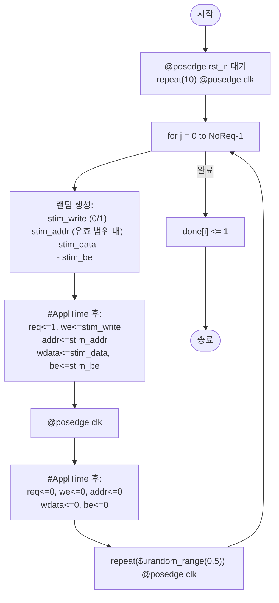
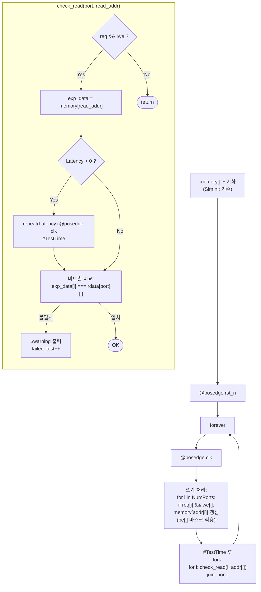

# tb_tc_sram.sv

`tc_sram` 모듈의 기능 검증 테스트벤치입니다. 랜덤 읽기/쓰기 요청을 생성하고 골든 모델과 비교하여 오류 여부를 확인합니다.

## 전체 구조



## 타이밍 다이어그램

```
         0       10ns    20ns    30ns
clk:     _/‾\_/‾\_/‾\_/‾\_/‾\_/‾\_
rst_n:   ___/‾‾‾‾‾‾‾‾‾‾‾‾‾‾‾‾‾‾‾‾‾‾
                  ↑ 리셋 해제 + 10 사이클 대기
req:              ___/‾‾‾\__________
                  +2ns↑   ↑ ApplTime 지연 후 인가
                         +8ns↑ TestTime에 결과 체크 (check_read)
rdata:            ________________/‾ ← Latency=1 사이클 후 출력
```

## 자극 생성 흐름 (`gen_stimuli`)



## 골든 모델 검증 (`proc_golden_model` + `check_read`)



## 모듈: `tb_tc_sram`

### 파라미터

| 파라미터 | 기본값 | 설명 |
|----------|--------|------|
| `NumPorts` | 2 | SRAM 포트 수 |
| `Latency` | 1 | 읽기 레이턴시 (클럭 사이클) |
| `NumWords` | 1024 | SRAM 워드 수 |
| `DataWidth` | 64 | 데이터 비트 폭 |
| `ByteWidth` | 8 | 바이트 비트 폭 |
| `NoReq` | 200000 | 포트당 요청 횟수 |
| `SimInit` | `"zeros"` | SRAM 초기화 방식 |
| `CyclTime` | 10ns | 클럭 주기 |
| `ApplTime` | 2ns | 클럭 에지 후 자극 인가 지연 |
| `TestTime` | 8ns | 클럭 에지 후 결과 검사 시점 |

### 내부 신호

| 신호 | 폭 | 설명 |
|------|----|------|
| `clk` | 1 | 클럭 |
| `rst_n` | 1 | 리셋 (active low) |
| `done[NumPorts-1:0]` | NumPorts | 각 포트 자극 완료 플래그 |
| `req/we/addr/wdata/be` | NumPorts | DUT 입력 구동 신호 |
| `rdata` | NumPorts | DUT 출력 (검증용) |
| `memory[NumWords-1:0]` | NumWords | 골든 모델 그림자 메모리 |
| `failed_test` | longint | 검증 실패 횟수 카운터 |

### 합격 기준

```
$info("Simulation done, errors: %0d", failed_test)
→ 로그에서 "errors: 0" 확인
```

## 시뮬레이션 스크립트

| 시뮬레이터 | 컴파일 | 실행 |
|-----------|--------|------|
| QuestaSim | [`compile_vsim.sh`](../scripts/compile_vsim.sh.md) | [`run_vsim.sh`](../scripts/run_vsim.sh.md) |
| Verilator | [`compile_vltor.sh`](../scripts/compile_vltor.sh.md) | [`run_vltor.sh`](../scripts/run_vltor.sh.md) |
| Xilinx xsim | — | [`run_xsim.sh`](../scripts/run_xsim.sh.md) |

## 관련 파일

- [`../src/rtl/tc_sram.sv`](../src/rtl/tc_sram.sv.md) — 검증 대상 모듈
